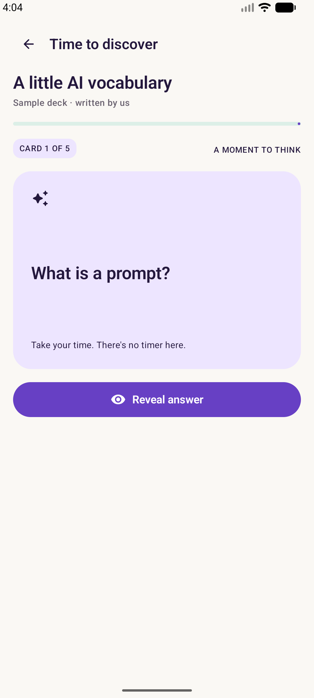
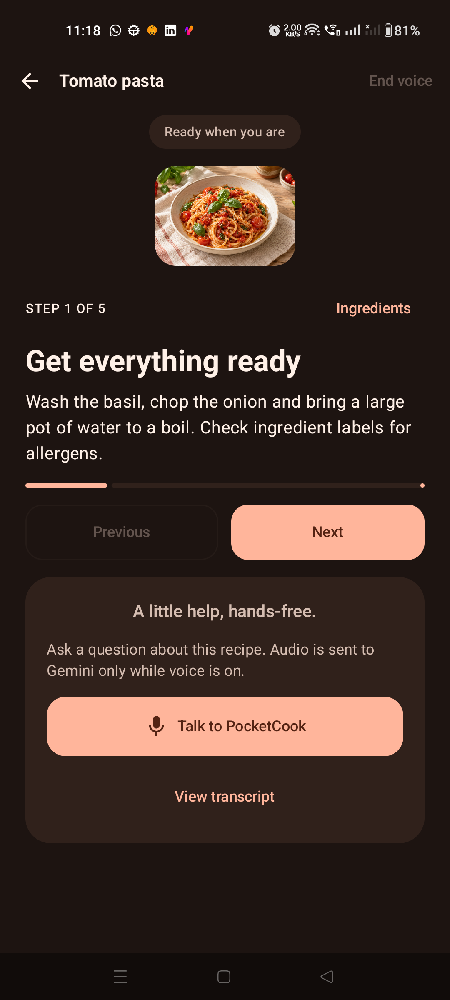
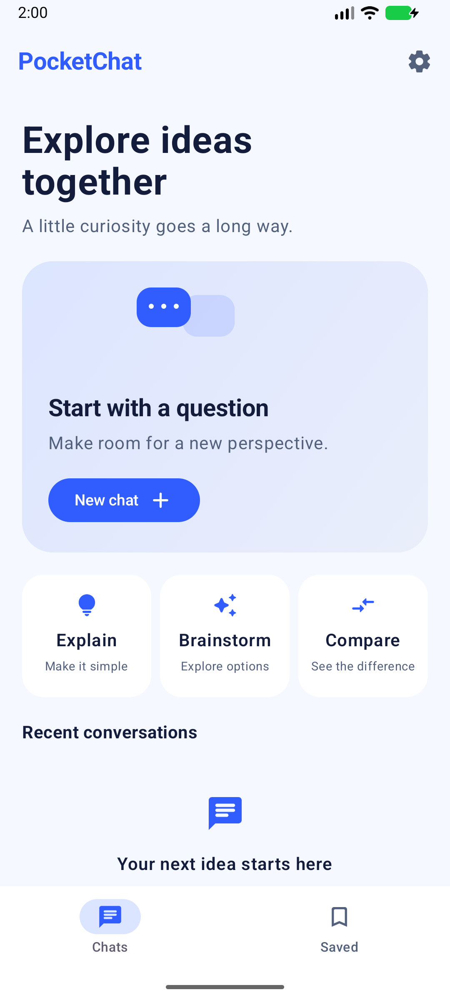
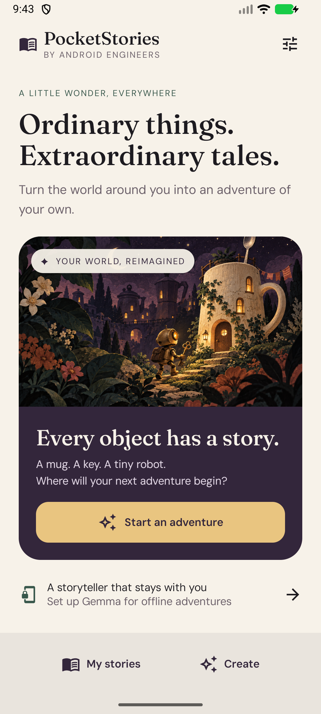
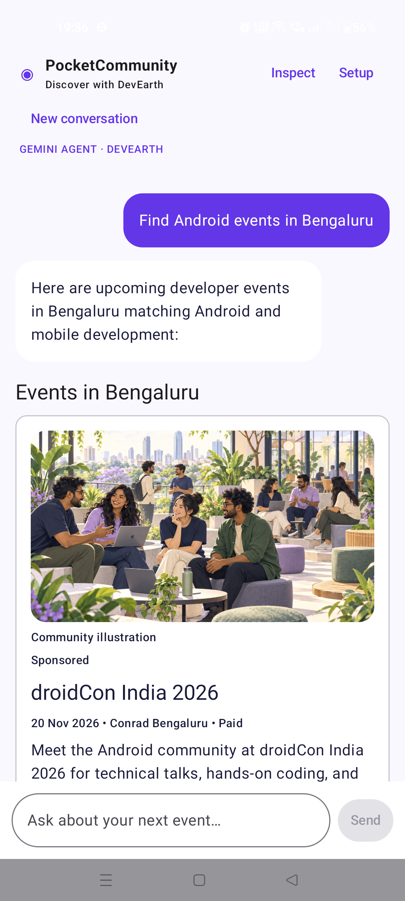
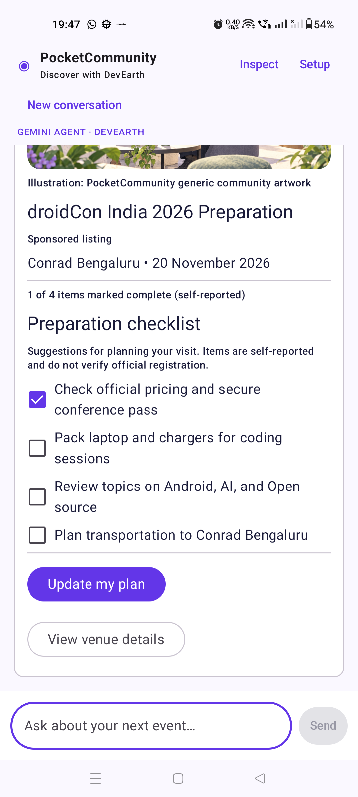

# Android + AI Cookbook

**Build AI features in Android apps with Kotlin and Jetpack Compose.**

Want to add Gemini Live, use ML Kit, run AI on-device, or build an agent with ADK? Explore the runnable samples, then pick a topic to follow its learning path.

**New preview:** [PocketCommunity — A2UI + DevEarth](a2ui/README.md): native event and preparation surfaces inside one conversation. Live Gemini agent required; key stays on the companion server.

## Sample apps

Each sample is an independent Android Studio project, focused on one Android + AI topic.

<table>
<tr>
<td width="260" align="center">
<a href="ai-fundamentals/README.md"></a>
</td>
<td valign="top">
<h3>PocketCards</h3>
<p><strong>Turn your notes into knowledge.</strong></p>
<p>An AI flashcard app: paste study notes, generate questions and answers with Gemini, review the result, and study your saved deck.</p>
<p><strong>Topic:</strong> AI Fundamentals<br />
<strong>Level:</strong> Introductory AI integration<br />
<strong>Status:</strong> Runnable sample · learning content in progress</p>
<ul>
<li>Firebase AI Logic and structured model output</li>
<li>Prompting, validation, cancellation, and failure handling</li>
<li>Jetpack Compose, Material 3, MVVM, and Navigation 3</li>
<li>Local decks, favorites, daily review dates, and progress</li>
<li>Light and dark themes; unit and device tests</li>
</ul>
<p><a href="ai-fundamentals/README.md">Browse &amp; run →</a> · <a href="https://www.androidengineers.in/codelabs/pocketcards-ai-flashcards?utm_source=github&amp;utm_medium=repository&amp;utm_campaign=android_ai_cookbook&amp;utm_content=pocketcards_showcase">Hands-on codelab</a> · <a href="https://www.androidengineers.in/roadmap/ai-android-fundamentals?utm_source=github&amp;utm_medium=repository&amp;utm_campaign=android_ai_cookbook&amp;utm_content=pocketcards_showcase">Learning roadmap</a></p>
<p><sub>Manual cards and the sample deck work without setup. AI generation uses your own Firebase project. Screenshots show the running app.</sub></p>
</td>
</tr>
<tr>
<td width="260" align="center">
<a href="gemini-live/README.md"></a>
</td>
<td valign="top">
<h3>PocketCook</h3>
<p><strong>A little help, hands-free.</strong></p>
<p>A cooking companion: choose a recipe, follow the steps, and ask Gemini for spoken guidance while you cook.</p>
<p><strong>Topic:</strong> Gemini Live in Android<br />
<strong>Level:</strong> Intermediate realtime voice integration<br />
<strong>Status:</strong> Runnable core · academy update awaiting deployment</p>
<ul>
<li>Direct Gemini Live over WebSocket, without Firebase</li>
<li>Microphone capture, PCM streaming, and speaker playback</li>
<li>Interruptions, mute, transcripts, and lifecycle cleanup</li>
<li>Jetpack Compose, Material 3, MVVM, and offline recipe progress</li>
<li>Audio regression tests, physical-device checks, and light/dark themes</li>
</ul>
<p><a href="gemini-live/README.md">Browse &amp; run →</a> · <a href="https://www.androidengineers.in/roadmap/gemini-live-android?utm_source=github&amp;utm_medium=repository&amp;utm_campaign=android_ai_cookbook&amp;utm_content=pocketcook_showcase">Learning roadmap</a> · <a href="https://github.com/anandwana001/android-website-revamp/blob/21ff713/src/data/pocketcook-codelab.ts">Codelab source (deployment pending)</a></p>
<p><sub>Recipes work offline. Voice uses your own Gemini key entered in the debug app; release voice is not yet available. Screenshot shows the real app before starting voice. Camera and tools are future extensions.</sub></p>
</td>
</tr>
<tr>
<td width="260" align="center">
<a href="gemini-chat/README.md"></a>
</td>
<td valign="top">
<h3>PocketChat</h3>
<p><strong>Explore ideas together.</strong></p>
<p>An Android Engineers AI learning companion: ask questions, watch Gemini answers stream, continue the conversation, and save useful ideas. Explore our roadmaps, codelabs, courses, and optional 1:1 mentorship through a curated resource directory.</p>
<p><strong>Topic:</strong> Gemini Chat for Android<br />
<strong>Level:</strong> Intermediate conversation and streaming integration<br />
<strong>Status:</strong> Runnable core · dedicated roadmap and codelab planned</p>
<ul>
<li>Direct Gemini text streaming over SSE, without Firebase</li>
<li>Multi-turn context, Stop/Retry, and stale-response protection</li>
<li>Room-backed history, saved answers, and draft recovery</li>
<li>Android Engineers system instructions and curated learning links</li>
<li>Jetpack Compose, Material 3, MVVM, and light/dark themes</li>
</ul>
<p><a href="gemini-chat/README.md">Browse &amp; run →</a> · <a href="gemini-chat/docs/learning-plan.md">Learning plan</a> · <a href="gemini-chat/docs/architecture.md">Architecture</a></p>
<p><sub>Chat uses your own Gemini key entered in the debug app. History works offline. Screenshot shows the actual home screen before the branding update. Structured takeaways, tool calling, and production cloud access are future milestones.</sub></p>
</td>
</tr>
<tr>
<td width="260" align="center">
<a href="gemma/README.md"></a>
</td>
<td valign="top">
<h3>PocketStories</h3>
<p><strong>Ordinary things. Extraordinary tales.</strong></p>
<p>A camera-to-story app in development, exploring Gemma on Android with local model downloads and a private bookshelf.</p>
<p><strong>Topic:</strong> Gemma on Android<br />
<strong>Level:</strong> Intermediate on-device multimodal integration<br />
<strong>Status:</strong> Building / Preview · end-to-end generation under validation</p>
<ul>
<li>CameraX capture, Photo Picker and bounded image preparation</li>
<li>Resumable model downloads, SHA-256 verification and private storage</li>
<li>LiteRT-LM integration, multimodal prompts, streaming and native cancellation</li>
<li>Compose, MVVM, Room stories and draft checkpoints</li>
<li>Model selection, hardware constraints and honest device verification</li>
</ul>
<p><a href="gemma/README.md">Explore the preview →</a> · <a href="gemma/docs/learning-plan.md">Learning plan</a> · <a href="gemma/docs/verification.md">Verification &amp; limitations</a></p>
<p><sub>Actual app screenshot; illustration is bundled artwork. No successful AI story generation is claimed. Build and automated tests pass; the tested emulator hits a GPU buffer limit. Physical-device generation and the academy codelab remain unverified/unpublished.</sub></p>
</td>
</tr>
<tr>
<td width="380" align="center">
<a href="a2ui/README.md"></a>
<a href="a2ui/README.md"></a>
</td>
<td valign="top">
<h3>PocketCommunity</h3>
<p><strong>Find your people. Get ready for your next developer event.</strong></p>
<p>Discover DevEarth events, explore venues, and prepare for your visit in one conversation. Gemini composes interactive native UI from a restricted component catalog.</p>
<p><strong>Topic:</strong> A2UI and agent-generated Android UI<br />
<strong>Level:</strong> Intermediate agent and UI integration<br />
<strong>Status:</strong> Live-agent preview · physical-phone flow verified · roadmap and codelab planned</p>
<ul>
<li>Official AndroidX A2UI parser, processor, and Material component catalog</li>
<li>Surfaces, component trees, data bindings, and outgoing actions</li>
<li>Conversation context and checkbox state sent back to Gemini</li>
<li>Validated component graphs, controlled links, setup and retry handling</li>
<li>Server-only Gemini credentials and an inspectable protocol flow</li>
</ul>
<p><a href="a2ui/README.md">Browse &amp; run →</a> · <a href="a2ui/README.md#how-a2ui-becomes-a-visible-card">How A2UI works</a> · <a href="a2ui/docs/verification.md">Verification &amp; limitations</a></p>
<p><sub>Actual live-generated UI on a physical Android phone. Artwork is a bundled illustration. Requires the companion server with your own Gemini key; no scripted runtime fallback. Production hosting and durable conversations are not implemented.</sub></p>
</td>
</tr>
</table>

## What do you want to build?

**25 topics · 3 runnable samples · 2 previews · 20 planned apps.** Start with PocketCards for AI fundamentals, PocketCook for realtime voice, or PocketChat for streaming conversations. PocketCook's expanded lessons and codelab are committed in the website repository and awaiting deployment. Each app README documents setup, verification, and remaining limitations.

### Add AI to your Android app

| Topic | What you’ll learn |
| --- | --- |
| [Gemini Live in Android](gemini-live/README.md) | PocketCook: direct voice conversations, PCM audio, interruptions, and explicit session restart. |
| [ML Kit GenAI + Gemini Nano](ml-kit-genai/README.md) | Add on-device text and image features with capability checks. |
| [On-device AI for Android](on-device-ai/README.md) | Run models locally and understand downloads, memory, and device support. |
| [Gemini Chat for Android](gemini-chat/README.md) | PocketChat: streaming conversations, Stop/Retry, local history, saved answers, and an Android Engineers AI guide. |
| [Firebase AI Logic](firebase-ai-logic/README.md) | Connect an Android app to Gemini with Firebase and App Check. |
| [Voice AI for Android](voice-ai/README.md) | Build speech-to-text, AI responses, text-to-speech, and turn-taking. |
| [Multimodal Android apps](multimodal-ai/README.md) | Combine camera, images, audio, and text in an AI feature. |

### Explore open models, local search, and computer vision

| Topic | What you’ll learn |
| --- | --- |
| [Gemma on Android](gemma/README.md) | PocketStories (Preview): camera-to-story integration, verified model downloads, local persistence and hardware compatibility. |
| [LiteRT and LiteRT-LM](litert/README.md) | Run custom models locally and understand the inference runtime. |
| [RAG and embeddings](rag-and-embeddings/README.md) | Search personal notes and answer questions with source citations. |
| [FunctionGemma and local tool calling](functiongemma/README.md) | Turn a natural-language request into an approved app action. |
| [ML Kit vision and text](ml-kit-vision/README.md) | Build OCR, barcode scanning, and other camera-based ML features. |
| [MediaPipe for Android](mediapipe/README.md) | Build live perception features such as gesture and pose detection. |

### Build agents and connect tools

| Topic | What you’ll learn |
| --- | --- |
| [A2UI for Android](a2ui/README.md) | PocketCommunity (Live-agent preview): Gemini-composed native UI, component catalogs, bound checklists, and action feedback. |
| [ADK for Kotlin](adk-kotlin/README.md) | Build JVM agents with tools, sessions, and orchestration. |
| [ADK for Android](adk-android/README.md) | Put an agent in your Android app with lifecycle-aware sessions and local tools. |
| [Koog for Kotlin](koog/README.md) | Build AI agents with the Kotlin-based Koog framework. |
| [MCP for Android developers](mcp/README.md) | Connect an Android experience to tools through a controlled backend. |
| [Android AppFunctions](appfunctions/README.md) | Expose app actions with typed inputs, permissions, and confirmation. |

### Learn the foundations and ship your app

| Topic | What you’ll learn |
| --- | --- |
| [AI for Android — start here](ai-fundamentals/README.md) | PocketCards: turn notes into flashcards and learn the AI fundamentals. |
| [Production AI on Android](production-ai/README.md) | Handle failures, evaluation, privacy, costs, and rollout. |
| [Gemini in Android Studio](gemini-in-android-studio/README.md) | Use AI assistance and Agent Mode to implement and debug features. |
| [Android CLI](android-cli/README.md) | Build and verify Android projects from the terminal. |
| [Android Skills](android-skills/README.md) | Use Android development skills to guide and check project changes. |
| [Create agent skills for Android](agent-skills/README.md) | Write reusable workflows for your coding agent. |

## Find your way around

```text
android-ai-cookbook/
├── adk-android/
├── adk-kotlin/
├── agent-skills/
├── ai-fundamentals/
├── android-cli/
├── android-skills/
├── appfunctions/
├── firebase-ai-logic/
├── functiongemma/
├── gemini-chat/
├── gemini-in-android-studio/
├── gemini-live/
├── gemma/
├── koog/
├── litert/
├── mcp/
├── mediapipe/
├── ml-kit-genai/
├── ml-kit-vision/
├── multimodal-ai/
├── on-device-ai/
├── production-ai/
├── rag-and-embeddings/
├── voice-ai/
└── docs/                     # Feature index and contribution guidance
```

Browse [all feature guides and their status](docs/features.md). Each topic folder will hold its own dedicated project when implemented.

## New to Android + AI?

Start with [AI for Android fundamentals](ai-fundamentals/README.md), then choose the topic for the app you want to build.

## Build plan and engineering

Follow the [app implementation order](docs/app-roadmap.md), [engineering standards](docs/engineering-standards.md), and [roadmap/codelab learning contract](docs/learning-contract.md). Development uses [official Android skills and project-local guidance](docs/skills.md).

## Help grow the cookbook

Have a recipe idea or want to add a sample? Read the [contribution guide](CONTRIBUTING.md) and use the [recipe template](docs/recipe-template.md).

Maintained by [Android Engineers](https://github.com/AndroidEngineers) · [Android Engineers Academy](https://www.androidengineers.in/roadmap?utm_source=github&utm_medium=repository&utm_campaign=android_ai_cookbook&utm_content=readme) · [Apache 2.0](LICENSE)
