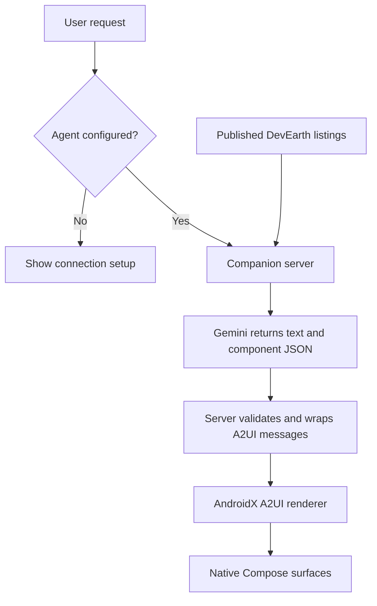
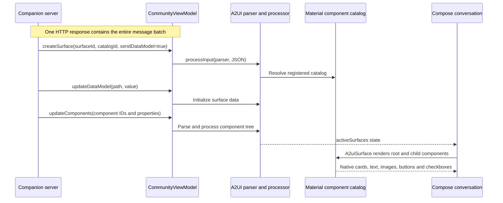
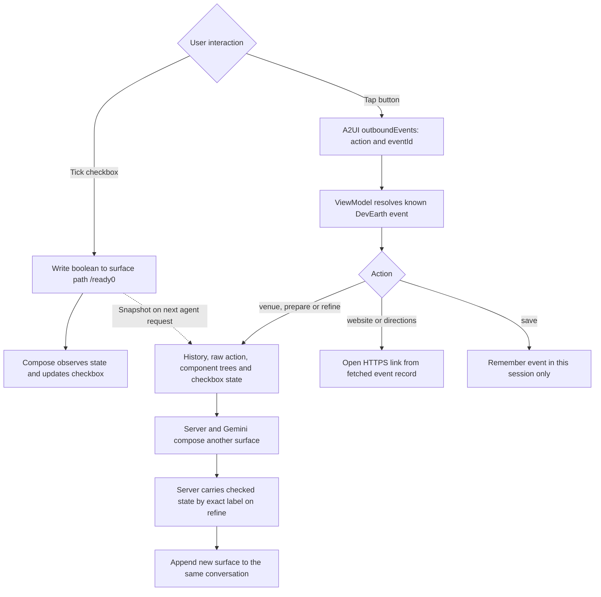
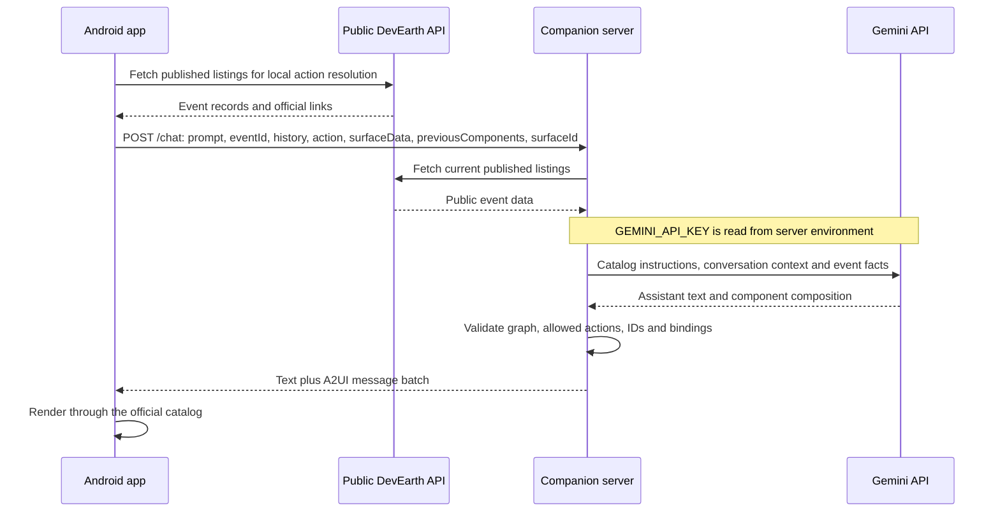
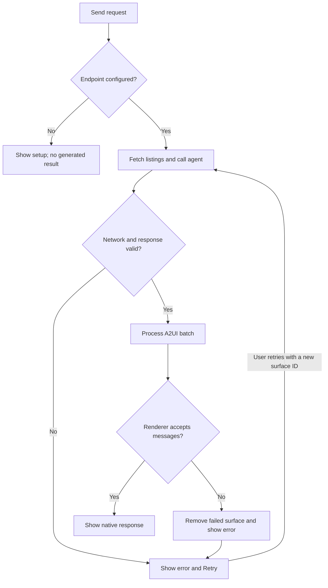

# PocketCommunity

**Find your people. Get ready for your next developer event.**

A light-theme conversational Android app powered by DevEarth listings and the AndroidX A2UI renderer. Event information, venue details, and interactive preparation checklists appear in one conversation.

**Status: live-agent preview.** Gemini composes the response UI using published DevEarth listings. Connect the companion server before starting. There is no scripted runtime or offline fallback.

A2UI itself needs no Gemini key: it is the protocol and renderer. This app uses Gemini as the UI producer, so its companion server needs your key. The Android app receives assistant text and validated A2UI messages, never the Gemini credential.



<p> </p>

Actual physical-phone screenshots from live Gemini requests. The community artwork is bundled illustration, not an event photograph. Screenshots capture scroll positions within the conversation; generated layouts vary. The preparation screenshot includes the final light-system-bar contrast fix.

## Try this journey

1. Ask **Find Android events in Bengaluru**.
2. Tap a generated venue action: the response becomes a native venue surface.
3. Ask for preparation help: Gemini composes a checklist with bound values.
4. Mark an item complete, then tap **Update my plan**. Gemini receives that state and proposes the next step.
5. Open **Inspect** to connect what you see with the actual protocol messages.

Buttons, wording and composition can vary between model responses. The app shell is Compose; response components are chosen by Gemini from a restricted catalog and rendered by AndroidX A2UI.

## What you learn

- Initialize the official A2UI parser, message processor, and Material component catalog.
- Render `createSurface`, `updateDataModel`, and `updateComponents` messages as native Compose UI.
- Bind checkbox values to surface data paths; route outgoing button events back into the application.
- Keep event lookup, ViewModel state, protocol messages, and UI rendering separate.
- Inspect actual inbound messages and outbound events.
- Keep Gemini credentials on a companion server, bound and validate generated component graphs, and resolve external links from trusted event records.
- Preserve unknown venue/price information and sponsorship labels.

## Run the Android app

1. Clone this repository and open **only `a2ui/`** in Android Studio.
2. Install Android SDK Platform 37. The Gradle daemon is pinned to Java 25 in `gradle/gradle-daemon-jvm.properties`; the app uses a Java 17 compiler toolchain. Gradle can provision these through Foojay, so allow downloads on the first build. The app runs on API 26+; the live flow has been tested on a OnePlus Nord 2 (DN2101), Android 13.
3. Sync Gradle and run the `app` configuration. Connect the companion server as described below. Firebase is not used.
4. Ask for Android events, explore a venue, then request a preparation checklist. Gemini chooses button labels and composition. Tick an item and tap **Update my plan**. **Inspect** shows actual protocol messages.

```sh
git clone https://github.com/AndroidEngineers/android-ai-cookbook.git
cd android-ai-cookbook/a2ui
./gradlew :app:assembleDebug :app:testDebugUnitTest :app:lintDebug
./gradlew :app:connectedDebugAndroidTest
```

Internet is required for Gemini and current DevEarth listings. Missing configuration, network failures, and invalid generated UI show setup or errors with retry; they never substitute scripted event cards.

## Connect Gemini — where the key goes

The key goes in **`a2ui/server/.env`**, never Kotlin, Gradle, Android assets, or the app's Setup field.

1. Create your own key in [Google AI Studio](https://aistudio.google.com/api-keys).
2. Install Node.js 22 or newer.
3. Copy the example and edit `.env` locally:

```sh
cd server
cp .env.example .env
# Set GEMINI_API_KEY and a Gemini model available to your project.
npm start
```

Your local `.env` contains `GEMINI_API_KEY`, `GEMINI_MODEL` (a model available to your project), and optional `PORT` (default `8787`). `.env` is ignored by Git. `curl http://127.0.0.1:8787/health` should report `configured: true`; this checks configuration presence, not model access. A successful in-app request is the real connection test.

4. On the Android emulator, open **Setup** and enter `http://10.0.2.2:8787/chat`. This is a debug-only, emulator-host exception. The development server binds to `127.0.0.1`.
5. For a connected physical phone, run `adb -s YOUR_DEVICE_SERIAL reverse tcp:8787 tcp:8787`, then enter **`http://127.0.0.1:8787/chat`** in Setup. Keep the server running and ADB connected. Reapply reverse after reconnecting. The Setup field takes this URL, **never an API key**. Release builds require an authorized HTTPS endpoint; do not expose this development server publicly (authentication, quotas and rate limits are not implemented).
6. Ask for an event. The backend reads current DevEarth listings, asks Gemini to compose components, validates the response, and returns A2UI messages. Gemini calls may incur provider charges.

The app sends your prompt, selected event ID, last 12 text turns, last 3 component trees, button action and current checkbox state to the endpoint you configure; that server sends the request and public listings to Gemini. Requests are not logged by this sample. The current transport returns a complete message batch; token/SSE streaming and agent error self-correction are not implemented yet.

## Setup troubleshooting

| Symptom | Check |
| --- | --- |
| App asks to connect | Setup needs the server `/chat` URL, not your Gemini key. |
| Connection refused on a phone | Keep `npm start` running; check `adb devices` and reapply port reverse for that phone. |
| Server asks for `GEMINI_API_KEY` | Edit `server/.env` locally and restart the server. |
| Model access or quota error | Check your Gemini project's model availability and quota, then tap Retry. |
| Invalid interface error | The generated component tree was rejected; Retry asks again. No scripted response is substituted. |
| Want to change servers | Start a New conversation first so existing context is not sent to another endpoint. |

## How A2UI becomes a visible card

A **surface** owns a component tree and a data model. A **catalog** maps allowed component names such as `Card`, `Text`, `Button` and `CheckBox` to native implementations. The agent describes a composition of those components; it does not send executable Kotlin.

This app sends three messages for each new surface, in this order:



For example, the preparation surface contains a `Card` whose child is a `Column`. That column references a heading, individual checkboxes and buttons by their IDs. The checkbox's `value` points to `/ready0` in that surface's data model. Text and an action label are separate components; the button references its label by ID.

The current network transport returns a complete batch. Processing separate messages demonstrates the protocol lifecycle, **not token streaming or a live stream of Gemini updates**.

## What happens when you interact?

Checkbox edits and buttons follow different paths. A checkbox updates its bound value locally. A button dispatches an A2UI event, which application code handles after looking up the event ID in the fetched listings.



The ViewModel forwards the actual action name, surface/component IDs and context, plus a snapshot of bound checkbox values. `createSurface` opts into data-model sharing. The endpoint persists locally; conversations and checklist state are session-only. **New conversation** cancels the pending request and clears surfaces. On **Update my plan**, the server matches existing checkbox labels to retain their values in the newly generated surface. Changed or new labels start unchecked; this is sample application logic, not automatic A2UI persistence. **Retry** requests a fresh surface after failure. There is no automatic agent self-correction.

## Where Gemini fits — and where the key stays



Gemini supplies the component composition. [`server/protocol.mjs`](server/protocol.mjs) validates it and constructs the protocol envelopes. It rejects unknown components, missing references, cycles, disallowed actions and fabricated event IDs. These checks do not guarantee truthful text or good UX: live output still needs evaluation against the listings.

Both Android and the server fetch discovery data. If a listing disappears between requests, the request fails visibly. Context is bounded; long conversations are not retained in full.

## Failure and retry



A missing server key returns a configuration error; a failed Gemini call or rejected component tree returns an error. There is no fake-result fallback. Test fixtures live only under `app/src/androidTest/` and are not packaged into the app.

## Follow the implementation

| File | Responsibility |
| --- | --- |
| [`CommunityRepository.kt`](app/src/main/java/com/androidengineers/pocketcommunity/data/CommunityRepository.kt) | Read DevEarth and call the required agent endpoint |
| [`CommunityViewModel.kt`](app/src/main/java/com/androidengineers/pocketcommunity/ui/CommunityViewModel.kt) | Own processor/state, forward context and handle actions |
| [`CommunityCatalog.kt`](app/src/main/java/com/androidengineers/pocketcommunity/ui/CommunityCatalog.kt) | Configure the Material catalog and bundled image renderer |
| [`CommunityScreen.kt`](app/src/main/java/com/androidengineers/pocketcommunity/ui/CommunityScreen.kt) | Host native A2UI surfaces inside the conversation |
| [`server/server.mjs`](server/server.mjs) | Fetch public facts and request component composition from Gemini |
| [`server/protocol.mjs`](server/protocol.mjs) | Validate model output and create A2UI messages |

The backend supports Text, Column, Row, Card, Button, CheckBox, Divider and a bundled illustrative Image. The app shell, composer and inspector are ordinary Compose; the response surfaces are rendered from A2UI messages.

## Verify locally

```sh
# From a2ui/
./gradlew :app:assembleDebug :app:testDebugUnitTest :app:lintDebug :app:assembleRelease
./gradlew :app:connectedDebugAndroidTest
cd server
npm test
```

The automated UI tests use a fake repository with the real renderer; they do not prove Gemini inference. Live physical-phone verification separately exercised event discovery, venue details, preparation and checkbox-aware follow-ups. See the [verification record](docs/verification.md) for exact coverage and limitations.

## Current boundaries

- Conversations, selected events, and checklist changes survive configuration changes through the ViewModel, but not process death. **Save event is session-only** and says so in the UI.
- The venue surface opens external directions. An embedded map is not implemented.
- Event images use clearly labelled generated community artwork, not event photography.
- No registration, tickets, payments, calendar writes, attendee data or hidden location access.
- Natural-language correctness, model-generated layout quality, large font/tablet layouts and production deployment still need evaluation.
- The A2UI libraries are alpha. This project pins AGP 9.1.1, Gradle 9.3.1, Kotlin Compose plugin 2.3.20, Compose 1.13.0-alpha03, Material 3 1.5.0-alpha28, A2UI 1.0.0-alpha01.

See [the app brief](docs/app-brief.md), [verification](docs/verification.md), and [artwork provenance](docs/artwork.md). Roadmap and codelab are the next learning-content milestone.
