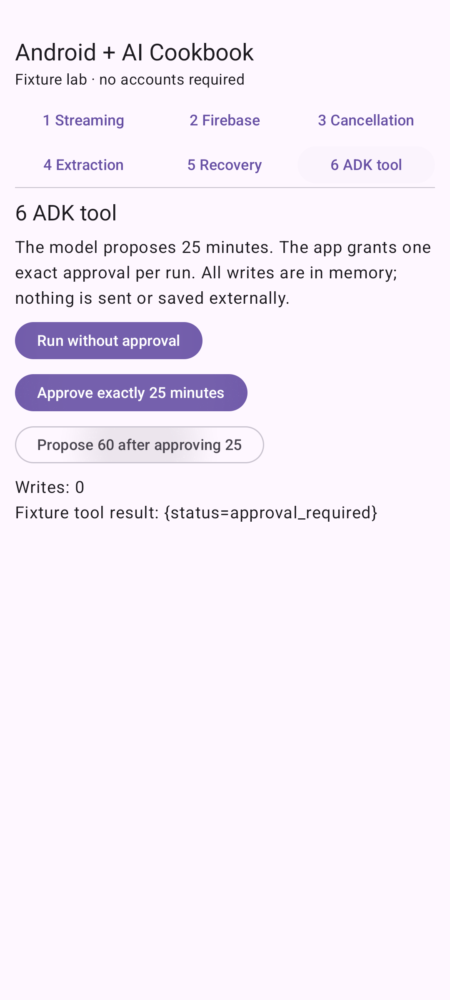

# One safe tool call with ADK on Android

**Status: tested-fixture.** Runnable Android sample with deterministic inputs. Firebase live inference and real-model ADK reasoning are not verified.

## See the result



Unapproved execution records zero writes. Exact approval records one in-memory write. A proposal for 60 minutes against an approval for 25 is denied.

## Before you start

Use Android Studio with AGP 9.0.1 support, JDK 17, Android SDK 36, and an API 26+ emulator/device. The wrapper pins Gradle 9.1.0; Compose compiler is 2.3.20 and Compose BOM is 2026.03.01. See [the sample setup](../../samples/recipe-lab/README.md) for the full dependency matrix and cloud configuration.

The published ADK 0.1.0 Android artifact requires minimum API 26, as verified by manifest merging. This sample follows the artifact rather than overriding its manifest requirement.

Fixture mode has no cloud cost and needs no account. It uses synthetic data only.

## Run it

```sh
git clone https://github.com/AndroidEngineers/android-ai-cookbook.git
cd android-ai-cookbook
git checkout v0.1.0-fixtures
cd samples/recipe-lab
./gradlew :app:assembleDebug :app:testDebugUnitTest
./gradlew :app:installDebug
```

Open **Android + AI Cookbook** on the emulator, select **6 ADK tool**, and choose **Run without approval, Approve exactly 25 minutes, then Propose 60 after approving 25**. In Android Studio, open `samples/recipe-lab` and run the `app` configuration. Windows uses `gradlew.bat`.

## Understand the request path

This uses the published Android ADK runtime, LlmAgent, a BaseTool with an explicit schema, and InMemoryRunner. ScriptedToolModel supplies deterministic tool-call responses through the actual SDK. ApprovalGate receives trusted application state separately from untrusted tool arguments. Its exact, one-use approval cannot be supplied as an extra model field. A three-call model budget and five-second run timeout bound the loop. Every run gets a fresh in-memory runner; no external action or durable storage occurs. This is not a demonstration of Gemini tool-selection quality.

Read [SafeAgent.kt](../../samples/recipe-lab/app/src/main/java/in/androidengineers/cookbook/SafeAgent.kt) and [the Compose screen](../../samples/recipe-lab/app/src/main/java/in/androidengineers/cookbook/MainActivity.kt). The source is authoritative; the lesson does not maintain a second copy of the implementation.

## Break it deliberately

Try the mismatch button. The regression suite also tests extra model arguments, fractional/out-of-range minutes, repeated approval consumption, and a model that never stops calling its tool.

**Regression checks:** `approvalIsExactAndSingleUse, modelCannotSupplyApprovalOrInvalidMinutes, actualAdkRunnerDeniesUnapprovedTool, actualAdkRunnerExecutesApprovedToolOnce, actualAdkRunnerRejectsMismatchedApproval, actualAdkRunnerStopsRepeatingModel`. See [unit tests](../../samples/recipe-lab/app/src/test/java/in/androidengineers/cookbook/RecipeTests.kt) and [Android tests](../../samples/recipe-lab/app/src/androidTest/java/in/androidengineers/cookbook/RecipeUiTest.kt).

## Try the next step

Add a second read-only tool without allowing its parameters to authorize record_practice.

**Assessment guide:** Test allowed reads with no approval, rejected writes with no approval, mismatched approval, and replay. For durable writes, add authenticated identity, expiry, concurrency-safe consumption, and an idempotency record at the server boundary before claiming production safety.

## Troubleshooting

- Gradle fails before compilation: select JDK 17 and install SDK 36. Run `./gradlew --version` to confirm the actual JVM.
- No device appears: start an API 26+ emulator, then check `adb devices` before installing.
- The result differs: confirm you selected the named recipe and fixture. A live provider is not expected to reproduce fixture wording.

## Continue learning

[Study the related Android Engineers Academy lesson](https://www.androidengineers.in/roadmap/adk-android/lesson/what-an-in-app-agent-does?utm_source=github&utm_medium=repository&utm_campaign=android_ai_cookbook&utm_content=adk-safe-tool) to connect this behavior to the broader engineering curriculum.

## Verification and limitations

See [the release evidence](../../docs/verification/v0.1.0-fixtures.md) for executed commands and environments. Deterministic tests do not establish production security, model quality, physical-device compatibility, or live cloud access. Recipe screenshots show fixture behavior.

## References

[Android coroutines testing](https://developer.android.com/kotlin/coroutines/test), [Firebase AI Logic setup](https://firebase.google.com/docs/ai-logic/get-started?platform=android), and [ADK on Android](https://developer.android.com/ai/adk). SDK interfaces were checked against the published artifacts during compilation. Recipe implementation and teaching material are original to this cookbook; the sample wrapper/setup originated from the Android CLI empty-activity template.
