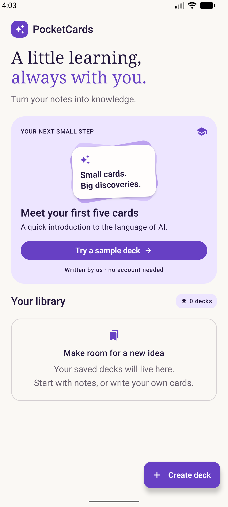
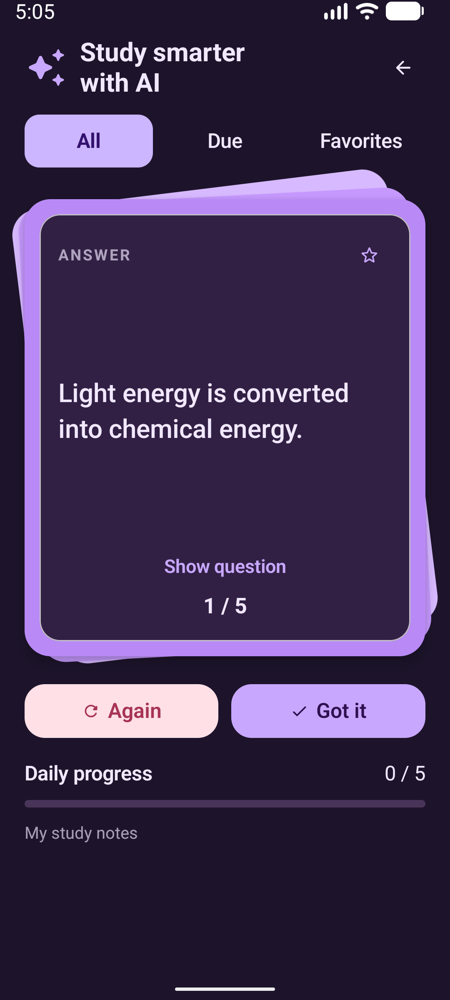

# PocketCards

**Turn your notes into knowledge.** A dedicated Kotlin and Jetpack Compose flashcard app for Android AI Fundamentals.

**AI Fundamentals · Kotlin · Jetpack Compose · Firebase AI Logic**

Paste notes → generate flashcards → review and save → study.

<table>
<tr><th>Library</th><th>Study</th><th>Dark theme</th></tr>
<tr>
<td></td>
<td></td>
<td></td>
</tr>
</table>

Screenshots from the running Android app. The dark-theme screenshot uses larger system text.

**Status: Runnable sample; learning content in progress.** Manual decks and the supplied study deck work without cloud setup. Live five-card generation has been verified with a private local Firebase configuration. Use your own Firebase project to enable generation. The companion roadmap and run-and-extend codelab are linked below. The full academy course and independent clean-setup walkthrough remain in progress.

[Run the app](#run-pocketcards) · [Set up Firebase](#enable-ai-generation) · [Code walkthrough](docs/codelab.md) · [Verification](docs/verification.md)

## Learn with PocketCards

Follow one app from concepts to working code:

1. [Learning roadmap](https://www.androidengineers.in/roadmap/ai-android-fundamentals?utm_source=github&utm_medium=repository&utm_campaign=android_ai_cookbook&utm_content=pocketcards_readme) — understand prompts, model behavior, architecture, privacy and evaluation through detailed lessons and exercises.
2. [Hands-on codelab](https://www.androidengineers.in/codelabs/pocketcards-ai-flashcards?utm_source=github&utm_medium=repository&utm_campaign=android_ai_cookbook&utm_content=pocketcards_readme) — clone the tested revision, configure your own Firebase project, trace real Kotlin code, and implement a test-first improvement.
3. [Local code walkthrough](docs/codelab.md) — explore the sample directly from this repository.

The academy codelab uses commit `c527701` so the code matches its explanations. Start from the completed sample and extend it; there is no empty starter project. Follow the clone commands in the codelab to check out that revision.

## What you’ll learn

Connect an Android feature to a cloud model, write a bounded prompt, request structured JSON, validate the result, and let the user review it before saving. Follow the request through Compose, a ViewModel, the Firebase adapter, and local storage; handle cancellation and failure along the way.

## What you can do

- Study a hand-authored five-card introduction to AI.
- Write, edit, save, reopen, and delete your own decks.
- Study with a layered flashcard stack, All / Due / Favorites filters, and daily progress.
- Star cards; use Again for review today or Got it for tomorrow.
- Configure Firebase to request structured flashcards from notes, review them, then save.

## Run PocketCards

Open this `ai-fundamentals` directory in Android Studio. Use JDK 17, Android SDK 36 / Build Tools 36.0.0, and an API 26+ emulator or device. The Gradle wrapper and project catalog pin the toolchain. Generated from the official Android CLI template; upgrading dependencies is separate work.

```sh
cd ai-fundamentals
./gradlew :app:assembleDebug :app:testDebugUnitTest :app:lintDebug
./gradlew :app:installDebug
```

Windows: use `gradlew.bat`. Set your local SDK path in `local.properties` or `ANDROID_HOME`; never commit that file. Gradle needs network access for the first dependency download.

## Your Firebase configuration stays local

Everyone running cloud generation uses their own Firebase project. This repository contains no shared Firebase project configuration. Keep your downloaded `google-services.json` only at `app/google-services.json`; Git ignores it, along with local SDK settings and signing keys. Do not force-add it or publish a configured APK as a way to share the sample.

The Android package is `com.androidengineers.pocketcards`. If your Firebase project has an Android app registered under the previous package, add a new Android app with this package in the same Firebase project and download its matching configuration. Do not edit the package inside an old configuration file by hand.

You can confirm the file stays excluded from the repository root:

```sh
git check-ignore ai-fundamentals/app/google-services.json
git ls-files '*google-services.json' # must produce no output
```

## Enable AI generation

1. Follow [Firebase AI Logic setup](https://firebase.google.com/docs/ai-logic/get-started?platform=android). Register Android package `com.androidengineers.pocketcards` in your project and enable the Gemini Developer API backend through Firebase AI Logic.
2. Place your configuration at `app/google-services.json` (gitignored). Rebuild; the Google Services plugin applies only when this file is present.
3. Configure App Check. Register your debug device token privately for development. The release source uses Play Integrity; configure enforcement, project quotas, and any required billing before distributing an app.
4. Confirm your project has access to `gemini-3.8-flash`, or deliberately change `MODEL_NAME` in `app/build.gradle.kts` to a supported structured-output model. See [structured output documentation](https://firebase.google.com/docs/ai-logic/generate-structured-output?platform=android).
5. Run the app, enter at least 40 characters of non-sensitive notes, and select **Generate flashcards**. Notes are sent to Google's cloud AI. Review the generated facts before saving.

No privileged Gemini API key belongs in the APK. Firebase client configuration is not a substitute for App Check, authorization where needed, usage limits, and backend/project controls. Do not commit credentials, debug tokens, or private notes.

If generation is unavailable, confirm configuration and rebuild. If it fails, check connectivity, App Check, API/model access, and quotas. Notes remain in the current session for correction/retry. Manual cards always remain available.

## Project guide

- `app/`: Android application and tests.
- `gradle/libs.versions.toml`: pinned library versions.
- [App brief](docs/app-brief.md) and [architecture](docs/architecture.md).
- [Learning plan](docs/learning-plan.md) and [run-and-explore walkthrough](docs/codelab.md).
- [Verification](docs/verification.md): what was actually tested and what remains.

[Learn AI for Android fundamentals](https://www.androidengineers.in/roadmap/ai-android-fundamentals?utm_source=github&utm_medium=repository&utm_campaign=android_ai_cookbook&utm_content=pocketcards) · [Browse all topics](../docs/features.md)
