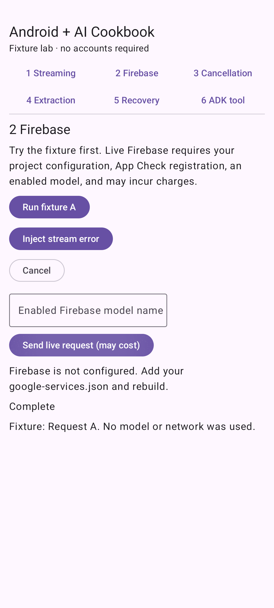

# First cloud feature with Firebase AI Logic

**Status: tested-fixture.** Runnable Android sample with deterministic inputs. Firebase live inference and real-model ADK reasoning are not verified.

## See the result



Fixture streaming completes. The live action shows “Firebase is not configured” instead of crashing. With your own configured project and enabled model, the same controller consumes Firebase text chunks.

## Before you start

Use Android Studio with AGP 9.0.1 support, JDK 17, Android SDK 36, and an API 26+ emulator/device. The wrapper pins Gradle 9.1.0; Compose compiler is 2.3.20 and Compose BOM is 2026.03.01. See [the sample setup](../../samples/recipe-lab/README.md) for the full dependency matrix and cloud configuration.

The published ADK 0.1.0 Android artifact requires minimum API 26, as verified by manifest merging. This sample follows the artifact rather than overriding its manifest requirement.

Fixture mode has no cloud cost and needs no account. It uses synthetic data only.

## Run it

```sh
git clone https://github.com/AndroidEngineers/android-ai-cookbook.git
cd android-ai-cookbook
git checkout v0.1.0-fixtures
cd samples/recipe-lab
./gradlew :app:assembleDebug :app:testDebugUnitTest
./gradlew :app:installDebug
```

Open **Android + AI Cookbook** on the emulator, select **2 Firebase**, and choose **Run fixture A, then Send live request without project configuration**. In Android Studio, open `samples/recipe-lab` and run the `app` configuration. Windows uses `gradlew.bat`.

## Understand the request path

FirebaseSource adapts Firebase AI Logic to the same TextSource interface. CookbookApplication initializes App Check before any model call. Debug builds use the debug provider; release builds use Play Integrity. The Google Services plugin is conditional so offline learning does not require a project. The fixture verifies the application boundary, not Firebase authentication or inference.

Read [FirebaseSource.kt](../../samples/recipe-lab/app/src/main/java/in/androidengineers/cookbook/FirebaseSource.kt) and [the Compose screen](../../samples/recipe-lab/app/src/main/java/in/androidengineers/cookbook/MainActivity.kt). The source is authoritative; the lesson does not maintain a second copy of the implementation.

## Break it deliberately

Leave configuration absent to see the setup error. Inject stream error to rehearse the UI failure path. Real provider auth/quota failures arrive through the stream error branch and have not been exercised against a cloud project.

**Regression checks:** `firebaseFixtureWorksWithoutConfiguration (instrumented), streamingFailurePreservesPartialTextAndRecovers`. See [unit tests](../../samples/recipe-lab/app/src/test/java/in/androidengineers/cookbook/RecipeTests.kt) and [Android tests](../../samples/recipe-lab/app/src/androidTest/java/in/androidengineers/cookbook/RecipeUiTest.kt).

## Try the next step

Configure your own Firebase project and record a live run with one denied App Check request and one successful request.

**Assessment guide:** Use the Firebase setup guide below. Record the model name, SDK versions, attestation configuration, date, device, and observed outcome. Keep debug tokens private. Only promote to tested-live after observing actual responses.

## Troubleshooting

- Gradle fails before compilation: select JDK 17 and install SDK 36. Run `./gradlew --version` to confirm the actual JVM.
- No device appears: start an API 26+ emulator, then check `adb devices` before installing.
- The result differs: confirm you selected the named recipe and fixture. A live provider is not expected to reproduce fixture wording.

## Continue learning

[Study the related Android Engineers Academy lesson](https://www.androidengineers.in/roadmap/firebase-ai-logic/lesson/practice-app-check-and-abuse-protection?utm_source=github&utm_medium=repository&utm_campaign=android_ai_cookbook&utm_content=firebase-first-feature) to connect this behavior to the broader engineering curriculum.

## Verification and limitations

See [the release evidence](../../docs/verification/v0.1.0-fixtures.md) for executed commands and environments. Deterministic tests do not establish production security, model quality, physical-device compatibility, or live cloud access. Recipe screenshots show fixture behavior.

## References

[Android coroutines testing](https://developer.android.com/kotlin/coroutines/test), [Firebase AI Logic setup](https://firebase.google.com/docs/ai-logic/get-started?platform=android), and [ADK on Android](https://developer.android.com/ai/adk). SDK interfaces were checked against the published artifacts during compilation. Recipe implementation and teaching material are original to this cookbook; the sample wrapper/setup originated from the Android CLI empty-activity template.

For live mode, follow [the complete Firebase setup instructions](../../samples/recipe-lab/README.md#optional-live-firebase-mode) before pressing the live request button.
