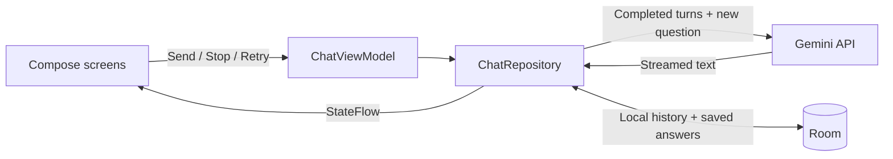

<div align="center">

# PocketChat

### Explore ideas together.

A Gemini chat app built with **Kotlin · Jetpack Compose · Material 3**.<br />
Ask a question. Watch the answer arrive. Keep the ideas worth saving.

**[Run the app](#run-pocketchat) · [What you'll learn](#what-youll-learn) · [Explore the code](#explore-the-code)**


*Actual Android emulator screenshot. [View the original design concept](docs/design.md).*

</div>

## One conversation, from first question to saved idea

PocketChat is the **Gemini Chat** sample in the [Android + AI Cookbook](../README.md). Build an AI conversation experience that handles more than a successful API call: partial answers, cancellation, follow-up context, app recreation, local history, and recovery when a request fails.

| In the app | Under the hood |
| --- | --- |
| **Explore** — start with Explain, Brainstorm, or Compare | Editable starter prompts; nothing is sent until you tap Send |
| **Chat** — watch an answer appear as it is generated | Gemini text streaming over server-sent events (SSE) |
| **Follow up** — continue the same conversation | Completed question/answer pairs become the next request's context |
| **Stay in control** — Stop or Retry | Cancel the HTTP call, preserve partial text, and prevent duplicate user turns |
| **Pick up later** — reopen and search conversations | Local Room persistence and interrupted-response recovery |
| **Keep good ideas** — save and copy answers | Saved snapshots remain available even if their source conversation is deleted |

**Current scope:** the core chat app is implemented. Structured takeaways, tool calling, the production backend, and the dedicated PocketChat codelab are still upcoming. See [verification and remaining checks](docs/verification.md).

## Run PocketChat

### 1. Open the Android project

```sh
git clone https://github.com/AndroidEngineers/android-ai-cookbook.git
cd android-ai-cookbook/gemini-chat
```

Open **`gemini-chat/` in Android Studio**, rather than the cookbook root. Each cookbook app is an independent project.

| Requirement | Version |
| --- | --- |
| JDK | 17 |
| Android SDK | 36 |
| Android device or emulator | Android 8.0 / API 26 or newer |
| Build variant | **debug** |

Android Studio can create the ignored `local.properties` file for your SDK location. Gradle and library versions are pinned in the project.

### 2. Install and open

Run the **app** configuration in Android Studio, or use a connected device:

```sh
./gradlew :app:installDebug
```

Open **PocketChat**. No Firebase project or `google-services.json` is required.

### 3. Connect your own Gemini key

1. Create a key in [Google AI Studio](https://aistudio.google.com/apikey), using your own project with Gemini access and quota.
2. In PocketChat, tap **Settings → Gemini connection**.
3. Paste the key into **Gemini API key**. Keep the default model, **`gemini-2.5-flash`**.
4. Tap **Use for this session**.
5. Open **New chat**, enter a question, and tap **Send**.

The key is entered in the running app, not in source code or a configuration file. It stays in memory and clears when you leave the app. Re-enter it in Settings when you return. Saving a key prepares the connection; your first successful answer verifies it.

### 4. Try a conversation that demonstrates context

```text
You:       I have a sunny balcony and space for two pots.
           Suggest a beginner-friendly garden.

Follow-up: Which of those needs less watering?

Follow-up: Turn that into a short weekend checklist.
```

Watch the response stream, try **Stop**, then **Retry**. Save a completed answer and open **Saved → Worth keeping** to find it again. History and saved answers remain available offline; generating a new answer needs a connection.

## Your Android Engineers AI guide

PocketChat now introduces itself as the Android Engineers AI learning assistant. Ask for help choosing a roadmap, finding practical codelabs, exploring courses, or deciding whether 1:1 mentorship fits your goal. The Home screen also offers direct links to all four destinations.

Recommendations use a small [curated resource directory](app/src/main/java/com/androidengineers/pocketchat/data/AndroidEngineersGuide.kt). Completed answers mentioning a known destination show an app-owned button to open it. Current pricing, availability, and bookings belong on the website. The assistant answers technical questions first and is instructed to suggest relevant resources without turning every reply into an advertisement.

This is system-prompt context, not model training or live website search. The AI does not impersonate a human mentor or book sessions.

## What you'll learn

| Topic | Question this sample helps you answer |
| --- | --- |
| **Compose + MVVM** | Who owns the draft, active conversation, and streaming state? |
| **Streaming protocols** | How do network chunks become complete SSE events and readable text? |
| **Coroutine cancellation** | Does Stop cancel the actual request, or just hide a spinner? |
| **Conversation context** | Which previous turns should be sent again, and which should be excluded? |
| **Request boundaries** | How do we prevent duplicate sends and ignore stale responses? |
| **Persistence and lifecycle** | What survives navigation, Activity recreation, and process restart? |
| **Failure recovery** | How should partial, blocked, truncated, and failed answers appear? |
| **Credential handling** | How does a learner-owned debug key differ from production authentication? |

The [learning plan](docs/learning-plan.md) maps these topics to a future roadmap and codelab for this same app. Those lessons are not published yet.

## How a message becomes an answer



**What Gemini receives:** an Android Engineers AI-guide system instruction, a curated directory of roadmap/codelab/course/mentorship links, selected completed turns from the current conversation, and your latest message. Context uses a conservative **24,000-character budget**, not an exact token count. Stopped and failed answers are excluded; the app tells you when older completed history is omitted.

**What is not connected:** Google Search, full Android Engineers course content, external documents, and saved-note retrieval. The directory provides navigation context, not course-text retrieval. This app does not train or fine-tune Gemini. It uses the pretrained model, so an answer about its training knowledge is normal. No fake-answer fallback is used in the running app.

## Explore the code

Start at the screen, then follow Send through the ViewModel, repository, and transport:

| File | Responsibility |
| --- | --- |
| [PocketChatApp.kt](app/src/main/java/com/androidengineers/pocketchat/ui/PocketChatApp.kt) | Home, Conversation, Saved, Settings, and the composer |
| [ChatViewModel.kt](app/src/main/java/com/androidengineers/pocketchat/ChatViewModel.kt) | Selected conversation and restorable drafts |
| [ChatRepository.kt](app/src/main/java/com/androidengineers/pocketchat/data/ChatRepository.kt) | Generation lifecycle, retries, state, and saved answers |
| [Models.kt](app/src/main/java/com/androidengineers/pocketchat/data/Models.kt) | Conversation models, context policy, and service contracts |
| [GeminiChatService.kt](app/src/debug/java/com/androidengineers/pocketchat/data/GeminiChatService.kt) | Debug-only HTTP streaming, SSE parsing, and provider error handling |
| [ChatDatabase.kt](app/src/main/java/com/androidengineers/pocketchat/data/ChatDatabase.kt) | Room-backed local storage |

Read [architecture decisions](docs/architecture.md) for the tradeoffs, including the initial aggregate-based Room schema and planned improvements.

## Verify your changes

```sh
# Compile, run unit tests, and lint
./gradlew :app:assembleDebug :app:testDebugUnitTest :app:lintDebug

# Run the Android journey tests with an emulator/device connected
./gradlew :app:connectedDebugAndroidTest

# Verify the release build separately
./gradlew :app:assembleRelease
```

Recorded checks: **19 unit tests passed; 5 emulator tests passed for the preceding core-chat build**; debug and release builds passed; lint reported **0 errors and 15 upgrade-related warnings**. Device tests use controlled model responses. They verify app behavior, not live Gemini answer quality. [Full verification record →](docs/verification.md)

## Connection and data behavior

- **Debug:** bring your own key. Messages and selected conversation context go to Gemini; no author-owned credentials are included.
- **Release:** the direct Gemini transport is excluded. Cloud chat needs the planned authenticated backend; local history remains usable.
- **Local data:** Room stores conversations and saved answers with backup disabled. Deleting local content does not delete provider-side records.
- **Model changes:** Settings accepts another compatible model ID. The current request config uses `thinkingBudget: 0`; a replacement model must support that option.

<details>
<summary><strong>Troubleshooting</strong></summary>

| What you see | What to do |
| --- | --- |
| Add-key banner after returning | Expected: backgrounding clears debug credentials. Re-enter the key in Settings. |
| API key/access error | Check the key and Gemini API access for your project. |
| Quota reached | Check project/model quota in AI Studio and retry later. |
| Model unavailable | Check the exact model ID and access for your project. |
| Stopped or interrupted answer | Partial text is retained but excluded from future context. Retry the last incomplete turn or ask a new question. |
| Output limit reached | Ask a narrower question. Truncated output is not marked complete. |
| History cannot open | Restart and check available storage. Unreadable history is not silently overwritten. |

</details>

---

Built for the **[Android Engineers](https://www.androidengineers.in/)** learning community.<br />
**[Explore the cookbook](../README.md) · [PocketCards](../ai-fundamentals/README.md) · [PocketCook](../gemini-live/README.md) · [PocketChat learning plan](docs/learning-plan.md)**
