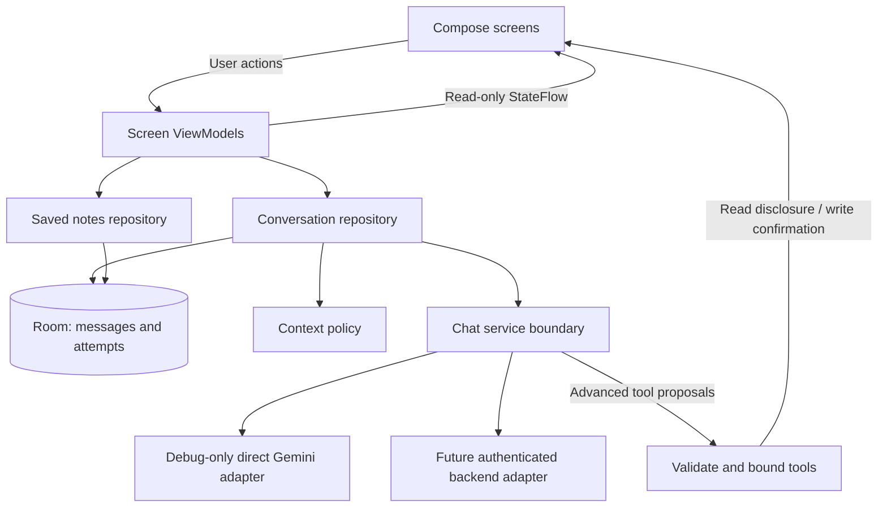

# PocketChat architecture decisions

Proposed architecture; names below are planned contracts, not implemented classes.

## Structure

Single `app/` module with `ui/home`, `ui/chat`, `ui/saved`, `ui/settings`, `ui/theme`, `data/local`, `data/chat`, and `data/notes`. Add `domain/context` and `domain/tools` only when their policies exist. Put the key-entry UI and direct-key transport in a debug source set. Keep optional server code independently buildable under `server/` when that milestone starts.

Composables render immutable state and emit actions. ViewModels own screen coordination, without Activity/Context references. Repositories own persistence and model calls; SDK DTOs never become UI models. Narrow interfaces isolate network and clock/ID behavior for deterministic tests. Manual constructor injection is sufficient initially.

## State and concurrency

Draft → submitting → streaming → complete, stopped, failed, or interrupted. Each attempt has a stable ID, conversation ID, and assistant message ID. A single app-session generation coordinator owns at most one active request. Send is atomic; switching conversations cancels before starting another request. Leaving the app cancels and clears debug credentials. Configuration changes must not cancel or duplicate an attempt; bind foreground/background handling to process lifecycle, not individual Activity recreation.

Use structured coroutine cancellation and cancel the underlying transport. Gate all arriving chunks by active attempt identity, including writes. Persist partial text at bounded intervals (starting target: at most four writes/second) and flush on terminal states; test and tune this target. If the process dies, the latest checkpoint survives and any previously active attempt becomes interrupted on restart. Never resume a dead network stream as if it remained connected.

Proposed entities: Conversation (ID, title, timestamps), Message (ID, conversation, role, body, order), GenerationAttempt (ID, assistant message, state, provider/model, finish reason, optional usage), SavedNote (ID, type, validated content, optional source IDs), ToolExecution (identity, approval/execution status, result). Final schema and migrations follow the pinned Room implementation.

## Context policy

Build each request from the system instruction, eligible completed turns, and new user input. Preserve complete user/assistant pairs; omit failed/stopped attempts. Bound input and output against the selected model, retaining the most recent complete turns. Surface when older context is omitted. Use documented token counting where available; do not pretend character counts are exact tokens. Oversized single input produces an actionable limit message. Automatic summarization is deferred until summary fidelity can be evaluated.

Retries are explicit. Keep the original user message and create a new assistant attempt; replace or collapse failed attempts visibly without silently combining their output. Test provider history requirements for tool parts, signatures, and IDs before implementing replay.

## Rendering and storage boundaries

Render supported Markdown and code as text/UI components; never execute returned code or raw HTML. Require user action to open external links. Do not automatically fetch remote image URLs embedded in answers. Partial Markdown must remain readable during streaming. Local search uses Room queries first; embeddings are out of scope.

Saved answers are snapshots. Deleting a conversation removes its messages/attempts and nulls saved-note source links; saved copies remain clearly labeled. Clear-all removes both. Explicitly exclude conversation/key material from backup by default and test data-extraction rules. No prompt bodies or keys in logs/analytics.

## Advanced chapters

Takeaways: request a schema, parse a complete result, then validate required fields, lengths, count bounds, and semantic usability before exposing Save. Invalid results are editable/retryable and are not persisted as valid notes.

Tools: permit only declared operations. Initial candidates are `searchSavedNotes` and `proposeSavedNote`. Validate arguments and size limits; show what note content will be shared with Gemini. Require user approval for writes and reuse a persisted execution identity so duplicate delivery does not duplicate a note. Start with a maximum of three tool rounds per user turn; exceeding the cap is a visible terminal state. Model instructions never override application permissions.

## Verification matrix

Unit: fragmented streaming events, cancellation races, duplicate send, retry context, history pruning, transaction recovery, schema rejection, tool limits, duplicate effects. UI/device: first send, stop, offline history, rename/delete, rotation, background/process restart, IME, 200% font, dark/light, TalkBack, compact/wide. Live evaluation: follow-up reference, long/code answer, blocked or empty output, quota/auth/network failure where reproducible. Record actual evidence and separate simulated failures from provider observations.
