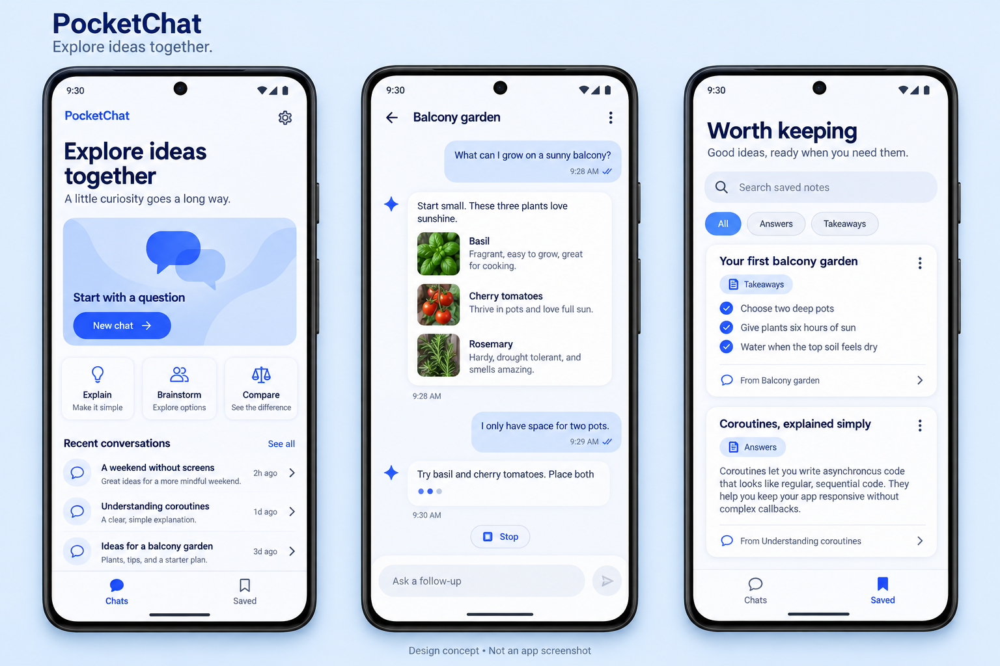

# PocketChat design specification

Status: design concept, not an implemented screenshot. The written specification is the implementation contract; the generated board is a visual direction.

## Identity and tokens

Explore ideas together. Friendly, calm, and clearly Android-native. Use Material 3 components and scalable typography, with a branded blue default palette. System light/dark follows the device; dynamic color can be evaluated later without compromising contrast.

| Token | Light | Dark |
| --- | --- | --- |
| Primary | #315DFF | #B6C4FF |
| On primary | #FFFFFF | #002A78 |
| Background | #F6F8FF | #10131D |
| Surface | #FFFFFF | #1B2030 |
| Main text | #131C3B | #E5E9FA |
| Secondary text | #53617C | #B5BED6 |
| User bubble | #DCE5FF | #253C70 |

Starting values, subject to measured contrast checks. Spacing scale: 4/8/12/16/24/32dp; horizontal phone padding 20dp. Feature cards 24dp radius, message cards 20dp, controls at least 48dp touch targets. Body 16sp with comfortable line height; headings 28–32sp; metadata at least 12sp. No fixed-height text containers.

## Home

Top bar: PocketChat and Settings. Heading “Explore ideas together”; secondary “A little curiosity goes a long way.” Hero: locally drawn chat-bubble illustration and New chat. Prompt options Explain / Brainstorm / Compare populate an editable draft; they do not auto-send or pretend to be separate models. Recent conversations list supports search, rename, and delete. Bottom navigation: Chats / Saved. Empty history shows a useful starting prompt; long history scrolls with stable item keys.

## Conversation

Compact top bar: Back, editable conversation title via menu, overflow. Right-aligned user bubble; assistant content left-aligned, with generous reading width, paragraphs/lists/code blocks. Timestamp is optional metadata. Copy/Save appear for completed answers; Stop is persistent and reachable while generating. Incomplete answers say Stopped/Interrupted/Failed and expose Retry. Do not use delivery/read ticks: these imply semantics the app cannot establish.

Composer remains above the keyboard with safe system insets. Multiline input; disable empty Send and additional Send while a request is active. Preserve unsent draft. Hardware Enter inserts a line break; Ctrl/Cmd+Enter sends, with accessible hints. Auto-scroll only when already near the bottom; otherwise show a Jump to latest control. Announce generation state changes, not every token, to accessibility services.

The mockup contains decorative plant thumbnails. **These are not part of the text-only MVP:** render equivalent text rows, without image fetching/generation or fake rich-result claims. Do not add attachment, microphone, or search-grounding controls.

## Saved

Heading “Worth keeping”; subtitle “Good ideas, ready when you need them.” Search saved notes, answer cards, excerpt, optional source link, copy and remove. Start with Answers only; show All / Answers / Takeaways filters when the advanced takeaways feature exists. Empty state explains how to save a completed response. Source navigation opens the correct conversation/message; a deleted source is labeled unavailable while the saved snapshot remains readable.

## Settings and connection

Theme, cloud data explanation, debug connection setup, clear local data. Key field is masked and never prefilled from a committed value. Distinguish Not configured, Ready, Invalid key, Quota exceeded, and Offline with recovery guidance. Do not claim a key is valid before a provider request verifies it. Release build explains unavailable cloud setup until the backend exists. Destructive clear-all requires a confirmation showing scope.

## Layout and state matrix

| Situation | Expected presentation |
| --- | --- |
| Compact phone | One destination at a time; composer above IME |
| Expanded window | Conversation list + active chat, bounded answer reading width; rail navigation |
| Dark theme | Same hierarchy with dark tokens; no washed-out text |
| Large font | Wrapping labels and expanding cards; no clipped composer/actions |
| Streaming | Partial answer, clear activity indicator, Stop |
| Empty/blocked output | Explicit explanation and recovery; no blank success bubble |
| Failure after partial output | Preserve text, failure label, explicit Retry |
| Offline | Saved/history usable; clear connection requirement for new generation |
| Deleted source | Saved snapshot remains; unavailable-source label |

Use Navigation 3 scene-based list/detail if the pinned supported toolchain passes its feasibility gate. Keep stable standard Compose layouts; experimental Grid/FlexBox are unnecessary for this design. Verify phone, tablet, rotation, keyboard, 200% font, TalkBack, and light/dark before calling UI complete. Capture real app screenshots for README only after implementation; retain this board labeled concept.

## Asset provenance

The concept was generated with the built-in image generation tool. [Exact prompt](design/prompt.txt). No third-party screenshot is used as an app screenshot. The illustration should be implemented with local simple shapes; bitmap text and phone frames are not app assets.
