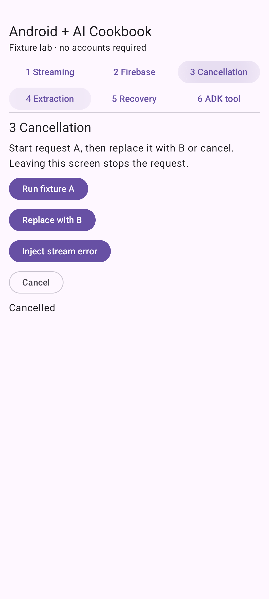

# Cancel a response when the user changes tasks

**Status: tested-fixture.** Runnable Android sample with deterministic inputs. Firebase live inference and real-model ADK reasoning are not verified.

## See the result



The final response belongs only to B. Cancel freezes the partial text and displays Cancelled. Selecting another recipe or backgrounding the activity cancels work.

## Before you start

Use Android Studio with AGP 9.0.1 support, JDK 17, Android SDK 36, and an API 26+ emulator/device. The wrapper pins Gradle 9.1.0; Compose compiler is 2.3.20 and Compose BOM is 2026.03.01. See [the sample setup](../../samples/recipe-lab/README.md) for the full dependency matrix and cloud configuration.

The published ADK 0.1.0 Android artifact requires minimum API 26, as verified by manifest merging. This sample follows the artifact rather than overriding its manifest requirement.

Fixture mode has no cloud cost and needs no account. It uses synthetic data only.

## Run it

```sh
git clone https://github.com/AndroidEngineers/android-ai-cookbook.git
cd android-ai-cookbook
git checkout v0.1.0-fixtures
cd samples/recipe-lab
./gradlew :app:assembleDebug :app:testDebugUnitTest
./gradlew :app:installDebug
```

Open **Android + AI Cookbook** on the emulator, select **3 Cancellation**, and choose **Run fixture A, then Replace with B or Cancel**. In Android Studio, open `samples/recipe-lab` and run the `app` configuration. Windows uses `gradlew.bat`.

## Understand the request path

Cancelling a coroutine handles cooperative producers; a generation identifier also rejects stale callbacks. Each start invalidates the previous generation and resets output. DisposableEffect removes the lifecycle observer and cancels when the screen leaves composition; ON_STOP handles backgrounding. Rotation intentionally cancels the request rather than resuming it. Request identity and visible state are in memory and are not restored after process death.

Read [Streaming.kt](../../samples/recipe-lab/app/src/main/java/in/androidengineers/cookbook/Streaming.kt) and [the Compose screen](../../samples/recipe-lab/app/src/main/java/in/androidengineers/cookbook/MainActivity.kt). The source is authoritative; the lesson does not maintain a second copy of the implementation.

## Break it deliberately

Start A and immediately replace it. The unit test also directly delivers an old request chunk after replacement; it is discarded.

**Regression checks:** `replacementRejectsLateChunksFromPreviousRequest, cancelStopsCollectionAndRejectsLateCallbacks; leavingScreenCancelsStream, backgroundStopsStream (instrumented)`. See [unit tests](../../samples/recipe-lab/app/src/test/java/in/androidengineers/cookbook/RecipeTests.kt) and [Android tests](../../samples/recipe-lab/app/src/androidTest/java/in/androidengineers/cookbook/RecipeUiTest.kt).

## Try the next step

Add a request history list without allowing a completed old request to overwrite the current screen.

**Assessment guide:** Create two requests with interleaved events. Verify each history entry contains only its own chunks while the selected request alone controls the main display. Add a regression test before changing the reducer.

## Troubleshooting

- Gradle fails before compilation: select JDK 17 and install SDK 36. Run `./gradlew --version` to confirm the actual JVM.
- No device appears: start an API 26+ emulator, then check `adb devices` before installing.
- The result differs: confirm you selected the named recipe and fixture. A live provider is not expected to reproduce fixture wording.

## Continue learning

[Study the related Android Engineers Academy lesson](https://www.androidengineers.in/roadmap/gemini-api-android/lesson/practice-conversation-and-streaming?utm_source=github&utm_medium=repository&utm_campaign=android_ai_cookbook&utm_content=lifecycle-cancel-stream) to connect this behavior to the broader engineering curriculum.

## Verification and limitations

See [the release evidence](../../docs/verification/v0.1.0-fixtures.md) for executed commands and environments. Deterministic tests do not establish production security, model quality, physical-device compatibility, or live cloud access. Recipe screenshots show fixture behavior.

## References

[Android coroutines testing](https://developer.android.com/kotlin/coroutines/test), [Firebase AI Logic setup](https://firebase.google.com/docs/ai-logic/get-started?platform=android), and [ADK on Android](https://developer.android.com/ai/adk). SDK interfaces were checked against the published artifacts during compilation. Recipe implementation and teaching material are original to this cookbook; the sample wrapper/setup originated from the Android CLI empty-activity template.
