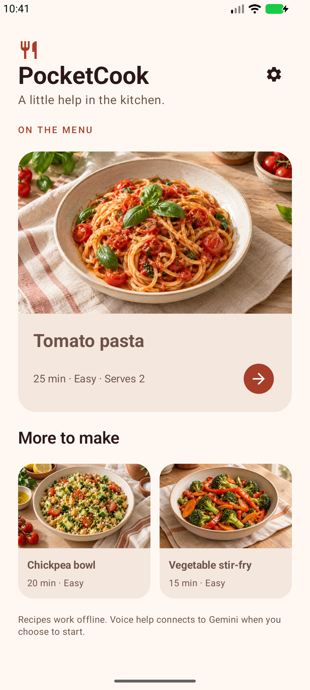
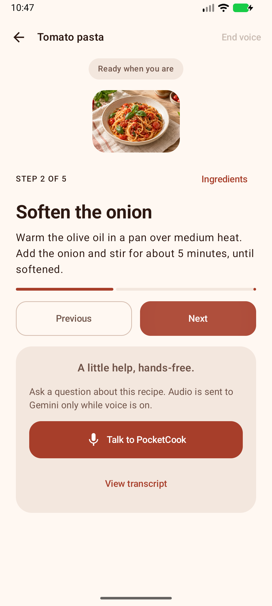
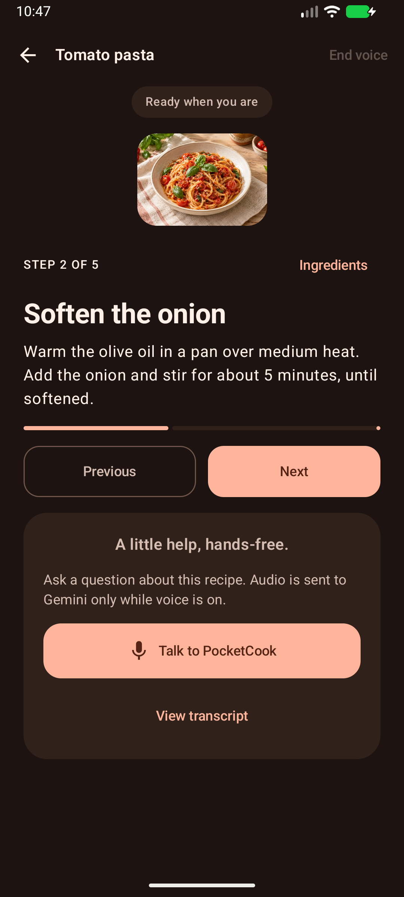
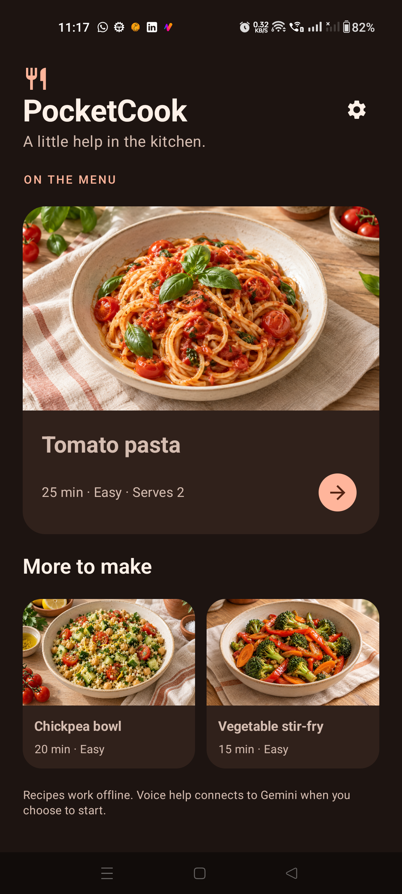
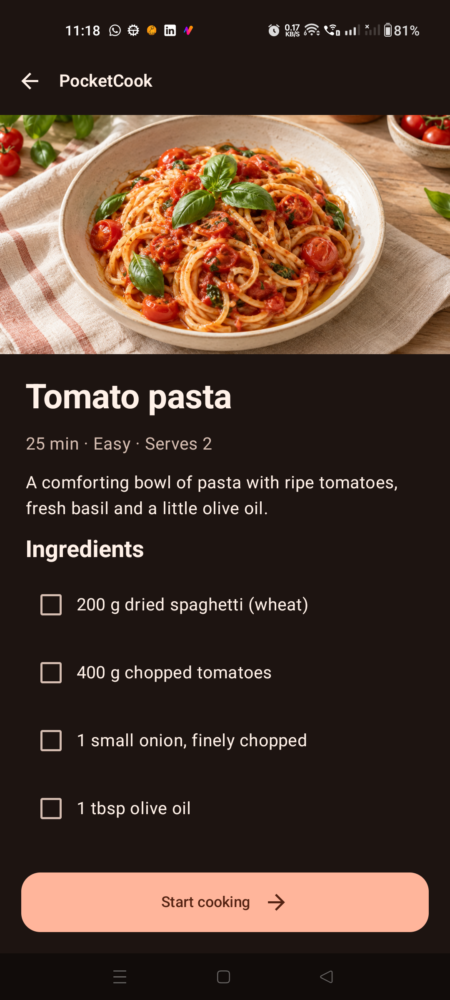

# PocketCook — Gemini Live in Android

A hands-free cooking companion built with Kotlin and Compose, connecting directly to Gemini Live without Firebase.

**Status: Building.** The first native slice is implemented. Live voice is confirmed working by the author on a physical phone. Capture/playback, mute and restart have automated device coverage; extended cloud-session acceptance remains open. See [verification](docs/verification.md) before treating this as a completed sample.

## Actual app screenshots

<p>
  
  
  
</p>

Captured from the Android emulator. These show the working offline UI, not proof of a live AI conversation. [Recipe details](docs/screenshots/details.png) · [Expanded cooking layout](docs/screenshots/cooking-expanded.png).

### On a physical phone — dark theme

<p>
  
  
  
</p>

Full portrait captures from a DN2101 on 2026-09-23. These screenshots show the real UI with voice idle; they are not a recording of the confirmed conversation.

## What you can try

- Browse three local recipes with original food imagery.
- Check ingredients, follow steps, retain step progress and finish cooking.
- Use cream/terracotta light mode, cocoa dark mode, and a two-column cooking layout on wide windows.
- In a debug build, enter your own Gemini API key at runtime and try the direct Live connection, microphone, playback, interruption and transcript implementation.

Voice needs network access and a Gemini project with access to the selected Live model. API usage may incur charges. No Firebase project or google-services.json is required.

## Run locally

```sh
git clone https://github.com/AndroidEngineers/android-ai-cookbook.git
cd android-ai-cookbook/gemini-live
./gradlew :app:assembleDebug
```

Open **gemini-live/** as the Android Studio project, not the cookbook root. Use JDK 17, Android SDK 36 and build tools 36.0.0. Point local.properties to your SDK or use ANDROID_HOME. The wrapper pins Gradle 9.1.0; the project pins AGP 9.0.1 and Kotlin 2.3.20. Minimum Android version: API 26; the current emulator checks use API 36.1.

Install app/build/outputs/apk/debug/app-debug.apk on your device. Recipes work immediately without credentials.

## Gemini Live API key setup

**Enter your key inside the running PocketCook debug app:** recipe library → **gear icon (Connection settings)** → **Gemini API key**. There is no key file to edit. PocketCook does not read a key from local.properties, .env, a shell environment variable, or google-services.json.

### 1. Create your own Gemini API key

1. Open [Google AI Studio → API Keys](https://aistudio.google.com/apikey) and sign in with your Google account.
2. Choose **Create API key** and select or create the project you want to use for this sample. If an existing project is missing, import it through **Dashboard → Projects → Import projects**, then return to API Keys.
3. Copy the generated key. This is a Gemini API key; there is no separate PocketCook-specific or Live-only key to create.
4. Check that your project has access and quota for the Live model you intend to use. Review billing requirements for that model before starting a session; a key alone does not guarantee model access.

For current account/key requirements and key-creation permission errors, follow Google's [API key guide](https://ai.google.dev/gemini-api/docs/api-key). Use a current key created in AI Studio if an older key is rejected.

### 2. Install the debug app

From the gemini-live directory, with a device or emulator connected:

```sh
./gradlew :app:installDebug
```

Alternatively, select the **debug** build variant in Android Studio and run the **app** configuration. Open **PocketCook** on the device. The release APK currently supports offline recipes only and does not offer API-key entry.

### 3. Paste the key in PocketCook

1. On the recipe library screen, tap the **gear icon in the top-right corner**. Its accessibility label is **Connection settings**.
2. In the **Connect your Gemini** dialog, paste the copied value into **Gemini API key**. Paste only the key, without quotes or a `Bearer` prefix.
3. In **Live model ID**, enter the exact Live model identifier supported by your project, without the `models/` prefix. The current app prefills `gemini-3.8-live`; this is a configurable default, not proof that your account has access. Consult the [Live WebSocket guide](https://ai.google.dev/gemini-api/docs/live-api/get-started-websocket) for current model guidance. A regular text-generation model is not interchangeable with a Live model.
4. Tap **Use for this session**. This stores the key in memory; it does not start recording or open a connection yet.
5. Stay in PocketCook while testing. If you switch to another app or background PocketCook, the key is cleared and must be entered again. Copy the key before completing this step.

Shortcut: tapping **Talk to PocketCook** on a cooking screen without a configured key opens the same dialog. After saving the key there, tap **Talk to PocketCook** again to connect.

### 4. Start and check your first conversation

1. Open **Tomato pasta** from the recipe library.
2. Tap **Start cooking** (or **Continue cooking** if progress was saved).
3. Tap **Talk to PocketCook**. Allow microphone access when Android asks.
4. Wait for **Connecting…** to change to **Voice connected** and **Listening · Mic on**. Saving a key by itself is not a successful connection test.
5. Ask: **“What should I do for this step?”** You should hear a recipe-related spoken answer. Tap **View transcript** to inspect the conversation if the model supplies transcription events.
6. While the assistant is speaking, say **“Please repeat that more slowly.”** Check that the earlier audio stops and the new answer is heard.
7. Test **Mute microphone**, **Unmute microphone**, then **End voice**. Leaving the app also ends voice. Recipe steps remain available offline.

This is the manual live verification procedure; a successful cloud conversation has not yet been recorded for this sample. Prefer a physical Android device for checking speaker echo, interruptions and microphone quality.

### Troubleshooting

| What you see | What to do |
| --- | --- |
| No API-key field | Install/run the **debug** variant. The release build intentionally has no key-entry path. |
| **Use for this session** is disabled | Fill both fields. Use the model ID alone, without `models/`, spaces or a URL. |
| Setup opens again after returning to the app | Expected: backgrounding clears the in-memory key. Paste it again, save, then tap Talk to PocketCook. |
| Saving the key does nothing audible | Expected: saving configuration does not connect. Open a recipe and tap Talk to PocketCook. |
| Connection fails, times out or is rejected | Check internet access, copied key, selected project, model availability and quota/billing. Open Connection settings to correct them, then retry. The app deliberately does not display raw provider errors that might contain sensitive data. |
| Microphone access is off | Use the displayed **Open Android settings** action, enable the microphone permission for PocketCook, return and re-enter the key if the app backgrounded. |
| Connected but no audible reply | Check volume and the active speaker/headset route. Try a physical device; emulator audio and host microphone access need separate setup. |
| Screenshot of setup is blocked | Expected: the credential dialog prevents screenshots. Use the screenshots above to locate the library gear icon. |

### How credentials are handled

The key is held in memory only and cleared when the app backgrounds. It is never embedded in BuildConfig, saved in preferences, or printed to application logs. Enter it only in the app's protected setup dialog, not in source files or commits. Clearing the key from PocketCook does not revoke it in Google AI Studio.

**Release builds currently provide offline recipes only.** A backend-issued ephemeral-token flow is planned for the deployment chapter and is not implemented yet.

Current voice limits: foreground sessions, a ten-minute local session cap, bounded media queues, explicit retry with fresh context rather than seamless session resumption. Camera, timers and function calling are later milestones. Ingredient checks are session-local; recipe step progress is stored locally. Transcripts are memory-only.

## Verify

```sh
./gradlew :app:assembleDebug :app:assembleRelease :app:testDebugUnitTest :app:lintDebug
./gradlew :app:connectedDebugAndroidTest
```

Unit tests exercise protocol validation, duplicate starts, stale callbacks, timeout, interruption, progress boundaries and credentials cleared on backgrounding. Device tests cover offline completion and explicit voice setup. Tests do not establish live model/audio quality.

## Design and learning

- [App scope and milestones](docs/app-brief.md)
- [Approved visual direction and concept board](docs/design.md)
- [Architecture](docs/architecture.md)
- [Course and codelab plan](docs/learning-plan.md)
- [Asset provenance](docs/assets.md)
- [Verification results and remaining work](docs/verification.md)

[Gemini Live in Android learning path](https://www.androidengineers.in/roadmap/gemini-live-android?utm_source=github&utm_medium=repository&utm_campaign=android_ai_cookbook&utm_content=topic_index). PocketCook-specific lessons and the 11-step codelab are implemented in the website repository; deployment is pending. Browse the [codelab source](https://github.com/anandwana001/android-website-revamp/blob/21ff713/src/data/pocketcook-codelab.ts) and [course study guide source](https://github.com/anandwana001/android-website-revamp/blob/21ff713/src/content/articles/gemini-live-android/pocketcook-course-study-guide.md) while the academy update is being deployed.

[Cookbook home](../README.md)
