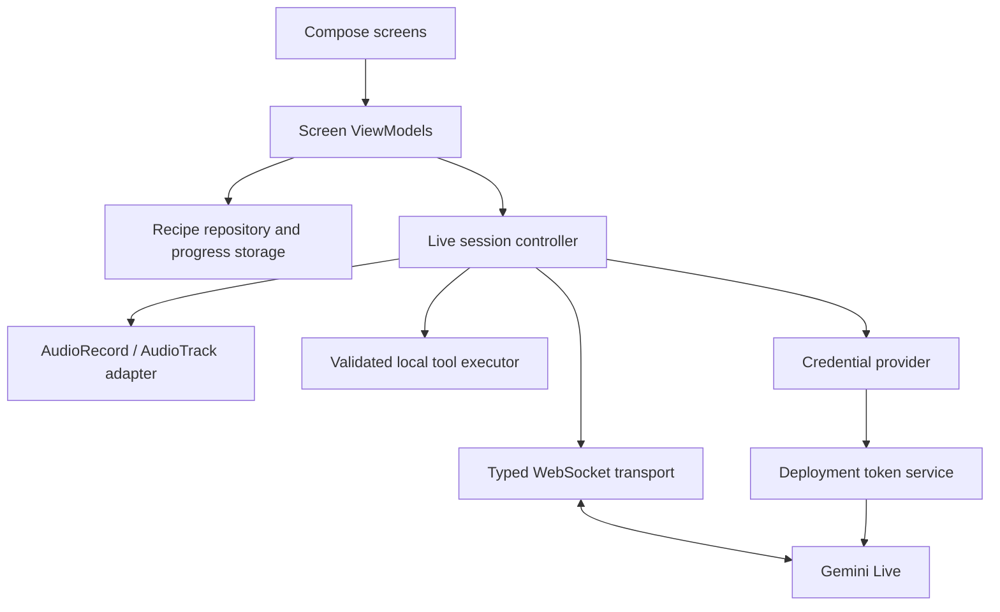

# PocketCook architecture proposal

Status: first implementation built; advanced tools, camera and token service remain planned. One Android app module with feature packages and manual constructor injection initially. Independent optional token service in `server/`.

## Boundaries

- UI renders immutable state and sends actions; no transport/audio code in composables.
- ViewModels coordinate screen behavior. The session controller owns a single active session and its child coroutines; an injected audio adapter owns Android audio resources.
- Transport serializes protocol DTOs and translates network events; protocol types do not escape into UI models.
- Recipe repository holds bundled content and durable progress. Persist stable recipe/step IDs and ingredient checks. Audio buffers, tokens and transcripts are not durable app state.
- Credential provider supports debug-only in-memory user keys and deployment ephemeral tokens. Reject missing configuration with a useful setup state.
- Tool executor owns allowed local effects; validate names, argument bounds and call IDs. Unknown calls get explicit errors. Deduplicate effects and handle cancellation.

Suggested packages: `ui/library`, `ui/recipe`, `ui/cooking`, `ui/theme`, `data/recipes`, `data/live`, `audio`, `tools`, `di`. Create abstractions only where ownership or testing benefits justify them.

## Session policy

Use separate connection state, microphone state and playback state. A monotonically changing session identity prevents late callbacks from affecting a replacement session. Wait for successful setup before sending media. Bound outbound/inbound queues, maximum session duration, retries and tool work; choose actual budgets after device measurement. Fail visibly on sustained overload rather than accumulating unlimited audio.

Interruption cancels/flushes queued playback for the interrupted turn. Muting stops capture/sending without pretending the socket is disconnected. End is idempotent and cancels child jobs, stops/releases audio and closes transport. Backgrounding ends voice in the first version; retain recipe progress and offer an explicit restart. Rotation alone must not start a second session. Process recreation restores only local progress.

Reconnect creates a new explicitly identified connection and reapplies the selected recipe/current step. Do not promise full conversation continuity: evaluate documented resumption support during implementation, record expiry behavior, and show when a fresh conversation starts.

## Feasibility decisions to resolve

Pin model/API version with actual project access; confirm transcript options, interruption events and tool cancellation behavior. Validate PCM formats, capture/playback rates and device audio routing against current API/Android docs. Test speaker echo and headset paths before promising hands-free quality. Choose navigation and persistence dependencies after evaluating existing project skills and pinned toolchain compatibility.

Read relevant official/project skills during implementation: cookbook-architecture, cookbook-ai-integration, android-cli, edge-to-edge, adaptive, navigation-3 as appropriate, testing-setup and later camerax. Do not interpret installed skills as compatibility evidence.

## Test strategy

Behavior tests: protocol parsing, setup gating, queue limits, stale-session events, interruption flushing, idempotent close, denied credentials, retry bounds, progress restore and last-step completion. Tool chapter adds invalid arguments, duplicate IDs and cancellation tests.

Compose tests cover main navigation and meaningful recovery. Physical-device checks cover permission denial, foreground/background, rotation, speaker/headset routes, network loss, interruption and repeated start/end. Live AI evaluation uses a small recorded set of recipe questions, ambiguous requests and unsupported requests; log outcomes with model/device versions and redact content by default. A fake cannot establish audio quality or model capability.

## First-slice decisions

- Simple Library → Details → Cooking → Finished navigation is represented by a screen enum owned by the ViewModel. Navigation 3 was evaluated but deferred until nested/back-stack requirements justify it. Rotation retains the ViewModel; process recreation returns to the library and reloads saved step progress on recipe selection.
- Manual constructor injection is intentional for this small project, per cookbook engineering standards. Fake audio and socket boundaries support tests without a DI framework.
- Audio owns communication-mode routing, transient audio focus, optional platform echo cancellation, PCM capture and playback. Physical-device routing and echo behavior remain verification gates.
- Capture, incoming messages, outgoing WebSocket backlog and playback have finite buffers. Setup timeout is 20 seconds; sessions end after ten minutes. Retry is explicit and starts a fresh conversation.
- Local recipe progress uses SharedPreferences; ingredient checks and transcripts remain memory-only in this slice. No database is needed for three bundled recipes.
- Test setup uses JUnit/coroutines and instrumented Compose tests. Screenshot tooling frameworks, Hilt and coverage plugins were not added merely for scaffold completeness; device screenshots and behavior tests provide the first-slice evidence.
- Release builds remove debug credential entry via BuildConfig.DEBUG and R8; deployment voice remains unavailable until the token-service chapter is implemented.

## Audio input buffering

AudioRecord nonblocking reads may return partial buffers. PcmChunker assembles these into complete 3,200-byte chunks (100 ms of mono PCM16 at 16 kHz) before delivery to the session controller. Eight queued chunks bound waiting input to 800 ms, plus one in-flight chunk. This avoids treating eight short device fragments as eight complete intervals. Genuine sustained overload ends the session with an explicit retry message rather than silently losing speech.

Mute clears partial capture and advances a capture epoch. The transport rejects queued chunks from earlier epochs, including an item already handed to a suspended consumer. End drains queued input and response events; connection generation guards reject stale session callbacks. The regression tests cover fragmentation, mute boundaries, overload and restart.

Reference: [AudioRecord read semantics](https://developer.android.com/reference/android/media/AudioRecord).
