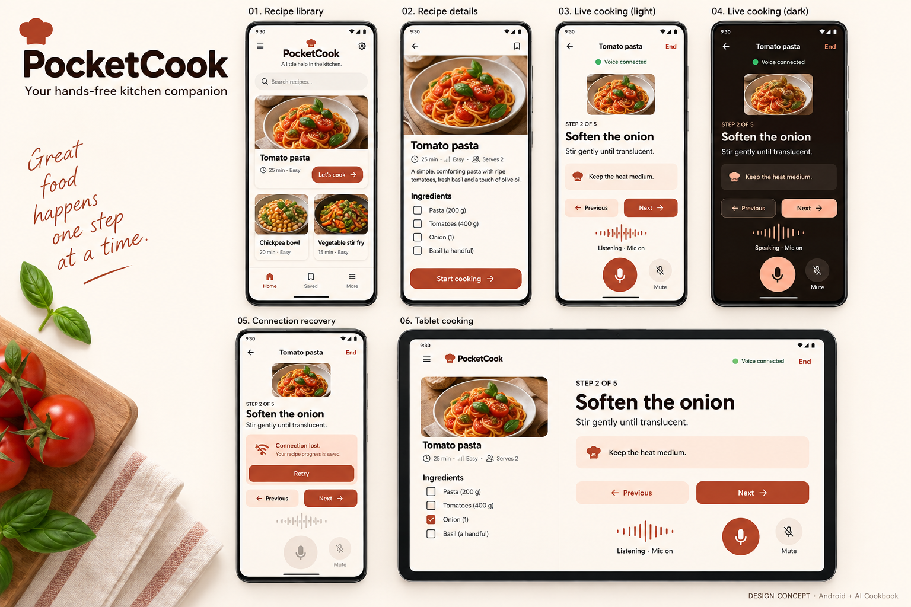

# PocketCook design specification

Status: proposed visual and interaction contract. The user approved the six-screen concept board as the visual direction on 2026-09-23. Implemented screenshots and component-level reference layouts are still pending; this is not proof of rendered app quality.

## Direction

Warm, calm and useful at arm's length. Take the concept board's terracotta cooking screen as the visual direction, with original layouts and assets. PocketCards retains its purple identity; PocketCook uses cream, tomato and dark cocoa. Shared family traits are rounded surfaces, strong hierarchy, friendly copy and a clear primary action.

Candidate colour tokens (validate contrast in rendered screens): cream background `#FFF8F2`, white surfaces `#FFFFFF`, cocoa text `#2D1913`, terracotta primary `#A73E2A`, pale peach containers `#FFE4D6`. Dark theme: cocoa background `#1D1411`, surface `#30211B`, warm white text `#FFF1E8`, peach accent `#FFB59B`. Use explicit app colours initially to preserve identity; dynamic colour is optional later.

Use Material typography with system fonts initially; title 28sp, section title 22sp, body 16–18sp and cooking instruction 24sp. Scale naturally with system font settings. Spacing 8/16/24/32dp; screen gutters 20–24dp; card corners 24dp. Primary cooking controls at least 56dp; other interactive targets at least 48dp. Never rely on colour or animation alone to convey state.

## Screens

### 1. Recipe library

Top: PocketCook wordmark and subtitle “A little help in the kitchen.” Settings icon opens connection configuration.

Hero: original/licensed food image, recipe title, duration and difficulty, “Let's cook” action. Below: two smaller recipe cards. Suggested initial content: tomato pasta, chickpea rice bowl and vegetable stir-fry. Review recipes for clarity before publication; do not fabricate nutrition values.

No search or category filters for three recipes. Each card opens details. A small resume card appears when progress exists. Offline state explains that recipes remain available and voice needs a connection.

### 2. Recipe details

Back button, food image (roughly upper third), title, metadata, short introduction, ingredient checklist and numbered steps. Fixed bottom action “Start cooking” respects navigation insets. Reading ingredients does not request microphone permission.

Start cooking opens the session screen in manual mode; “Talk to PocketCook” is the explicit recording/session action. Explain cloud audio processing before first activation. Credentials are configured via a setup sheet; never put credentials in screenshots or error messages.

### 3. Cooking session — the signature screen

```
‹  Tomato pasta                    End
                         Voice connected

        [compact food photograph]

STEP 2 OF 5                 Ingredients
Soften the onion
Stir gently until it becomes translucent.

          Previous         Next

PocketCook
“Keep the heat medium and stir occasionally.”
                              Transcript ↑

             [audio activity]
         Listening · Mic on

       Mute       [voice]       Camera*
```

`Camera*` is introduced only in the camera chapter, not shown as a dead control in the core release. The central voice control starts a session when idle and has an explicit label. While connected, persistent mute and End controls make their consequences clear; do not overload one icon with ambiguous actions.

Recipe step is the primary content; conversation is supporting content. Full transcript opens in a sheet with readable speaker labels and streaming text. It is session-local by default. Ingredients open in another sheet. Avoid stacking sheets.

Manual Previous/Next always work. Displayed step changes only when application state changes, never because generated text merely says “next step.” Completion has an explicit “Finish cooking” action and a small completion screen with “Back to recipes”; the last Next cannot index beyond the recipe.

## Session states

| State | Presentation and action |
| --- | --- |
| Idle/manual | “Ready when you are”; Talk to PocketCook; step controls available |
| Connecting | “Connecting…”; cancel available; repeated start disabled |
| Connected/listening | Mic-on label and measured input activity, not a fake random waveform |
| Responding | Speaking label and playback activity; interruption remains supported |
| Muted | “Microphone off”; unmute visible; assistant playback may finish |
| Interrupted | Clear old playback immediately; return to accurate current voice state |
| Disconnected/error | Inline explanation and Retry; recipe progress stays visible |
| Permission denied | Manual mode plus grant/settings action appropriate to permission state |
| Ended | “Voice session ended”; restart is explicit |

Connectivity, mic capture and assistant playback are independent facts. UI must support simultaneous capture/playback instead of forcing everything into an inaccurate single listening-or-speaking enum.

## Advanced surfaces

- Timer: visible local countdown card with cancel. Timer duration is validated and duplicate calls do not create duplicates. Initial timer is foreground-only; explain that background alerts are a separate feature.
- Camera: user-enabled preview with camera-on text, switch camera and stop sharing. Use a “Share view” interaction before considering continuous frames. A session must remain usable with camera denied/off.
- Expanded layout: ingredients/recipe column on the left, active step and voice panel on the right. On compact windows use sheets. Landscape and large text scroll naturally; controls must not cover instructions.

## Design handoff and verification

Before building the full UI, create six reference frames: library light, details light, cooking light, cooking dark, cooking disconnected, and expanded cooking. Use consistent recipe content and real font sizing, not unreadable generated placeholder text. Then implement component previews for RecipeCard, StepCard, SessionStatus, VoiceControls, TranscriptSheet and RecoveryBanner.

Compare device screenshots with these reference frames at the same viewport, including spacing, image crop, typography, control placement and insets. Reconcile design changes explicitly rather than silently replacing the agreed design. Test 200% text, TalkBack order, contrast, reduced animation behavior and keyboard access to setup fields. Decorative images have no redundant accessibility announcements.

Screenshots for README/codelab must come from the working app, show complete portrait screens, and distinguish concept designs from implementation. Maintain an asset provenance/license list; do not copy Compose Samples food assets without reviewing their license.

## Concept board v1



Created 2026-09-23 with AI image generation as visual exploration. The visual direction is approved; this remains a concept rather than an app screenshot or evidence that features work. Generated food imagery is part of the composite concept only; production image assets and provenance will be prepared separately.

### Implementation corrections

The written interaction contract takes precedence over incidental generated details:

- Omit library search, hamburger menus, bookmarks, and Home/Saved/More bottom navigation. Three recipes do not need these features.
- Include Ingredients and Transcript access on the cooking screen as specified above; the concept omits them.
- Give the primary voice control a clear accessible and visible action/state label. Do not ship an ambiguous duplicate microphone button beside Mute.
- Recovery uses a static disconnected presentation, not a decorative or animated inactive waveform.
- Ingredients and quantities in the concept are placeholders pending recipe review. Do not treat the pictured ingredient list as a complete cooking instruction.
- Typography, touch targets, contrast and expanded-window behavior require actual Compose previews and device checks; raster appearance does not verify them.

Next handoff: implement the agreed structure as Compose component previews, then compare screen captures at consistent viewports. Treat the board as colour, hierarchy and composition guidance, not a pixel-perfect executable specification.
