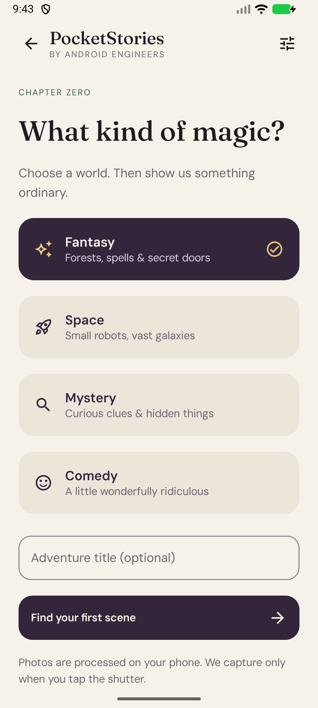
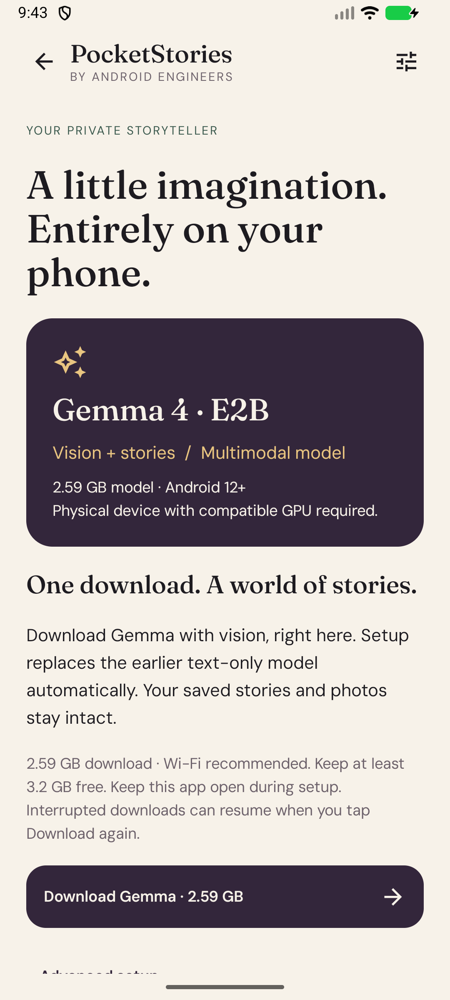

# PocketStories

**Ordinary things. Extraordinary tales.**

Turn a camera snapshot into a fictional adventure with Gemma running on your Android phone. Choose a genre, show an object, review the next scene, and keep your story on a private bookshelf.

**Status: Building / Preview.** UI, CameraX capture, photo import, model verification, story persistence and the real LiteRT-LM adapter are implemented. Physical-device vision inference is not yet verified. This is not a released learning journey.

Actual emulator screenshots: **bookshelf · create an adventure · model setup**. The cover is bundled artwork. The reader's handwritten sample is explicitly labeled; no screenshot claims successful model-generated output.

**Verification:** build, 17 unit tests and three emulator UI tests pass. End-to-end Gemma generation is still under validation. The tested emulator fails during vision initialization because the model requests a 152,409,600-byte buffer and its GPU backend allows only 134,217,728 bytes (128 MiB). Extra storage or guest RAM does not change that per-buffer limit. CPU vision support is not implemented; real-phone GPU inference remains to be verified. You do not need to re-download the correct model to diagnose this failure.

## Try the app

1. Clone `https://github.com/AndroidEngineers/android-ai-cookbook.git` and open **`gemma/`** in Android Studio.
2. Use JDK 17 and install Android SDK 36. The app targets Android 12+ (API 31), with runtime support dependent on device GPU/model compatibility.
3. Run `./gradlew :app:assembleDebug :app:testDebugUnitTest :app:lintDebug`.
4. Install the debug APK on a physical phone. The bookshelf and labeled sample adventure work without a model. Start an adventure to try the camera or system Photo Picker.
5. Before generation, open **Model setup** and follow the download steps below.

## Offline model setup

There is **no Firebase configuration or Gemini API key**. Internet permission is used to download model weights from Hugging Face; story generation runs locally.

1. Have at least **3.2 GB free** for the 2.59 GB model and working space. More space may be needed for runtime caches and saved stories.
2. Open **Model setup**, review the linked model details and terms, and tap **Download Gemma · 2.59 GB**. Wi-Fi is recommended.
3. Keep the app open while it downloads and verifies the checksum. Cancel pauses the transfer; tap Download again to resume. If Android closes the app, reopen it and tap Download to resume the saved partial file. This is not a scheduled background download.
4. Once ready, tap **Start creating**, choose a genre and capture/select a photo. Tap **Write the opening**.
5. After successful generation, verify another scene in airplane mode. Download verification proves file integrity, not GPU compatibility or generation quality.

Already have the exact pinned artifact? **Advanced setup → Import an existing model file** remains available. Import requires another 3.2 GB free in addition to the original file.

Pinned candidate: model revision `b3ca0d2f076785a8f4b2219ddbd2bdb99954eae1`; SHA-256 `181938105e0eefd105961417e8da75903eacda102c4fce9ce90f50b97139a63c`; size `2588147712` bytes. LiteRT-LM `0.16.1`, GPU language and vision backends. No CPU/cloud fallback is implemented. The runtime/model/device combination is still awaiting real inference verification.

The earlier `gemma-4-E2B-it-gpu.litertlm` download is text-only and cannot initialize the vision encoder. Tap Download in the updated app to replace that app-owned file with the multimodal artifact; stories and photos are preserved.

Wrong/corrupt files are rejected. Download and import use a temporary file and promote it only after size/hash validation. Model removal preserves saved stories. Model weights are not included in Git or the APK.

## First experience

- **Bookshelf:** your saved adventures and an explicitly labeled hand-written sample.
- **Create:** Fantasy, Space, Mystery or Comedy, with an optional title.
- **Camera:** deliberate snapshot, photo selection, or a text-only direction. Camera permission is requested only here.
- **Reader:** streamed draft, Stop, retry, accept/discard, and a direction for the next scene.
- **A spark of magic:** opt into shake suggestions after a saved scene; a button offers the same action. A gesture fills a proposed direction and does not start inference by itself.

Stories are fiction. The first slice does not identify editable inventory items, compare successive frames, generate images, export PDFs, narrate audio, branch timelines, or perform document RAG. Those are future features, not hidden parts of the model setup.

## What Android engineers learn

Read the implementation alongside the [learning plan](docs/learning-plan.md). These are code examples and exercises in a preview, not a completed production course.

| Topic | What to understand | Start in the source |
| --- | --- | --- |
| Compose + MVVM | Immutable state, lifecycle-aware rendering and event handling | [StoriesViewModel](app/src/main/java/com/androidengineers/pocketstories/StoriesViewModel.kt), [screens](app/src/main/java/com/androidengineers/pocketstories/ui/StoriesScreen.kt) |
| Camera and images | Permission, preview readiness, capture, orientation and bounded image size | [CameraScreen](app/src/main/java/com/androidengineers/pocketstories/ui/CameraScreen.kt), `data/` image handling |
| Model acquisition | HTTP Range resume, cancellation, partial files, storage checks and SHA-256 validation | [ModelDownloader](app/src/main/java/com/androidengineers/pocketstories/data/ModelDownloader.kt), [ModelStore](app/src/main/java/com/androidengineers/pocketstories/data/ModelStore.kt) |
| Gemma + LiteRT-LM | Weights versus runtime, multimodal content, engine/conversation ownership and streaming callbacks | [LocalStoryGenerator](app/src/main/java/com/androidengineers/pocketstories/data/LocalStoryGenerator.kt) |
| State and persistence | Accepted scenes versus drafts, Room storage, checkpoints, Stop/Retry and late-callback protection | [StoriesViewModel](app/src/main/java/com/androidengineers/pocketstories/StoriesViewModel.kt), `data/` persistence |
| Testing and hardware | Controlled fakes versus real inference, GPU buffer limits, and reproducible compatibility reports | [unit tests](app/src/test/java/com/androidengineers/pocketstories), [UI tests](app/src/androidTest/java/com/androidengineers/pocketstories/StoriesUiTest.kt), [verification](docs/verification.md) |

**Still to validate:** successful photo-to-story output, native cancellation on real hardware, airplane-mode inference, generation quality, latency and memory. The implementation demonstrates the API integration; it does not yet establish those runtime guarantees.

See [architecture](docs/architecture.md), [app brief](docs/app-brief.md), [learning plan](docs/learning-plan.md), and [verification](docs/verification.md). Website roadmap/codelab are not yet published for this app.

## Privacy and design

Captured images and model files live in app-private, no-backup storage. Room stories and app files are excluded from Android cloud backup and device transfer. No analytics or prompt logging is added. Local storage is not a claim of application-level encryption.

Fraunces and DM Sans are bundled under their SIL Open Font Licenses in `docs/licenses/`. The original bundled cover illustration was generated during development; Gemma does not generate that artwork. See [design notes](docs/design.md).
