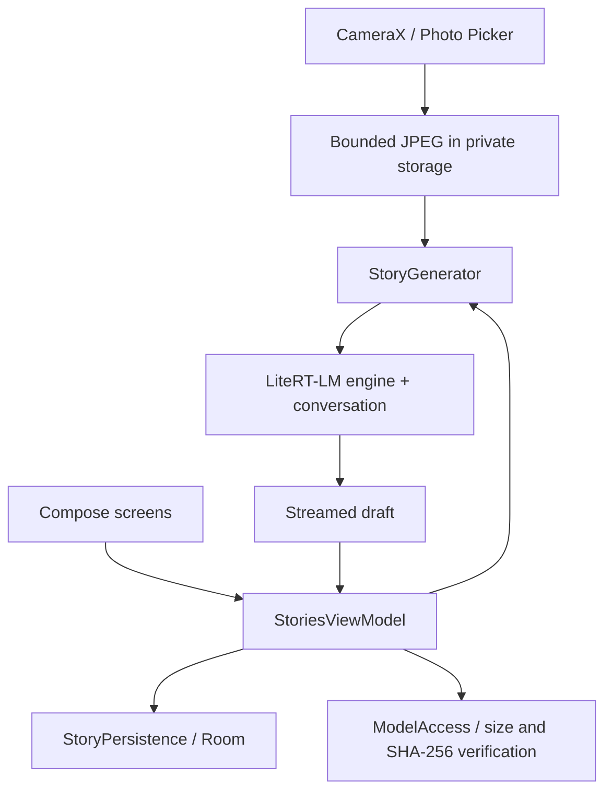

# PocketStories architecture

One independent Android application, `com.androidengineers.pocketstories`.

The ViewModel owns screen/session state and coordinates narrow injected persistence, model, image and generator boundaries. Compose does not call the model SDK. Story data is serialized per story in a Room row; this is intentionally a small-sample aggregate, not a normalized chapter database. Its limitations and a migration are advanced exercises.

One generation at a time. The adapter owns native handles behind a mutex. Initialization and native operations run off the main thread. Every generation builds a fresh conversation from accepted scenes and closes it and the engine after completion. This conservative implementation favors clear ownership over warm-session speed; measure the repeated-load cost before introducing an engine cache.

The adapter explicitly calls `cancelProcess` and waits for a terminal callback before closing native resources. Kotlin Flow cancellation by itself is not sufficient in the inspected SDK. If a runtime fails to acknowledge cancellation, the UI stays stopping rather than launching a second engine or racing close. This behavior needs physical-device verification. Output is limited to 320 tokens, engine context to 4096 tokens, one image, plus a two-minute operation timeout. Native initialization may not be immediately interruptible.

The app assembles a bounded prompt from recent accepted scenes; unfinished drafts are excluded. The character heuristic is not a tokenizer. Older omissions are disclosed. The newest image is resized to at most 768 pixels on its longest side using ImageDecoder, which also applies encoded orientation. No continuous frame stream is used.

Drafts checkpoint approximately every 750 ms and on cancellation/completion. Rotation retains the ViewModel. Leaving the app cancels active scene work; model import is separate. Process restart opens the persisted bookshelf; it never restores native handles or silently resumes inference. The last fraction of a second of a draft may not survive process death.

Initial navigation uses a small explicit screen state in the ViewModel. Navigation 3 is deferred until branching/deep links justify a destination back stack; Back and lifecycle behavior are verified for the current flow.

Permissions: camera and internet. Internet is used for model acquisition only; inference stays local. No microphone, location, contacts or activity-recognition permission. Accelerometer listening is foreground-only; story effects are opt-in and have a button alternative. Device time influences prompt atmosphere. No battery-triggered generation exists yet.
