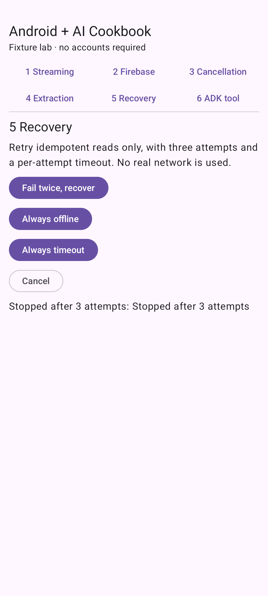

# Production AI on Android

Handle failures, evaluation, privacy, costs, and rollout.

**Status:** Examples available · simulated responses.

## Try the available examples

- [Retry, timeout, and offline behavior](bounded-recovery/README.md)

[Open Recipe Lab](../samples/recipe-lab/README.md) to run these examples. It is the shared Android Studio project; this folder contains the feature guides.

Live Firebase inference and real-model ADK reasoning remain unverified. See [verification details](../docs/verification/v0.1.0-fixtures.md).

## Learn step by step

[Follow the Production AI on Android learning path](https://www.androidengineers.in/roadmap/production-ai-android?utm_source=github&utm_medium=repository&utm_campaign=android_ai_cookbook&utm_content=topic_index).

[Browse all features](../docs/features.md) · [Cookbook home](../README.md)
