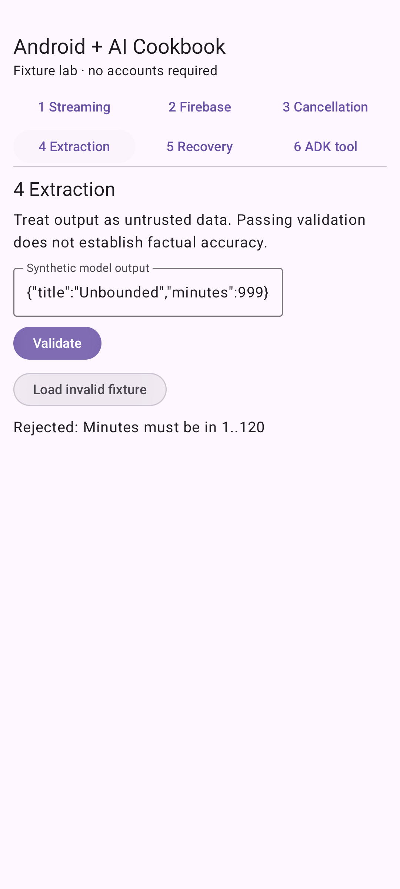

# Validate structured extraction

**Status: tested-fixture.** Runnable Android sample with deterministic inputs. Firebase live inference and real-model ADK reasoning are not verified.

## See the result



The valid title/minutes object is accepted. A 999-minute value is rejected. Numeric strings, unknown fields, missing fields, arrays, fractional minutes, and oversized output are also rejected.

## Before you start

Use Android Studio with AGP 9.0.1 support, JDK 17, Android SDK 36, and an API 26+ emulator/device. The wrapper pins Gradle 9.1.0; Compose compiler is 2.3.20 and Compose BOM is 2026.03.01. See [the sample setup](../../../samples/recipe-lab/README.md) for the full dependency matrix and cloud configuration.

The published ADK 0.1.0 Android artifact requires minimum API 26, as verified by manifest merging. This sample follows the artifact rather than overriding its manifest requirement.

Fixture mode has no cloud cost and needs no account. It uses synthetic data only.

## Run it

```sh
git clone https://github.com/AndroidEngineers/android-ai-cookbook.git
cd android-ai-cookbook
git checkout v0.1.0-fixtures
cd samples/recipe-lab
./gradlew :app:assembleDebug :app:testDebugUnitTest
./gradlew :app:installDebug
```

Open **Android + AI Cookbook** on the emulator, select **4 Extraction**, and choose **Validate, then Load invalid fixture and Validate again**. In Android Studio, open `samples/recipe-lab` and run the `app` configuration. Windows uses `gradlew.bat`.

## Understand the request path

The parser accepts a bounded JSON object, checks its exact key set, verifies primitive types, and validates application ranges before constructing ExtractedTask. A correctly shaped object can still be factually wrong. Human review and source checks are separate from schema validation. This recipe begins at the model-output boundary and does not call a model.

Read [Extraction.kt](../../../samples/recipe-lab/app/src/main/java/in/androidengineers/cookbook/Extraction.kt) and [the Compose screen](../../../samples/recipe-lab/app/src/main/java/in/androidengineers/cookbook/MainActivity.kt). The source is authoritative; the lesson does not maintain a second copy of the implementation.

## Break it deliberately

Edit the JSON to use "minutes":"25", add an "execute" field, or remove the title. Validation rejects the input rather than coercing it.

**Regression checks:** `validExtraction, extractionRejectsMalformedAndUnsupportedValues; extractionAcceptsAndRejects (instrumented)`. See [unit tests](../../../samples/recipe-lab/app/src/test/java/in/androidengineers/cookbook/RecipeTests.kt) and [Android tests](../../../samples/recipe-lab/app/src/androidTest/java/in/androidengineers/cookbook/RecipeUiTest.kt).

## Try the next step

Add a dueDate field that accepts a valid ISO calendar date and rejects impossible dates.

**Assessment guide:** Test a leap day, an invalid day, missing/null values, and a correctly typed but impossible date. Use a date parser rather than a regular expression alone. Decide explicitly whether dates in the past are allowed.

## Troubleshooting

- Gradle fails before compilation: select JDK 17 and install SDK 36. Run `./gradlew --version` to confirm the actual JVM.
- No device appears: start an API 26+ emulator, then check `adb devices` before installing.
- The result differs: confirm you selected the named recipe and fixture. A live provider is not expected to reproduce fixture wording.

## Continue learning

[Study the related Android Engineers Academy lesson](https://www.androidengineers.in/roadmap/gemini-api-android/lesson/structured-output-and-validation?utm_source=github&utm_medium=repository&utm_campaign=android_ai_cookbook&utm_content=validated-extraction) to connect this behavior to the broader engineering curriculum.

## Verification and limitations

See [the release evidence](../../../docs/verification/v0.1.0-fixtures.md) for executed commands and environments. Deterministic tests do not establish production security, model quality, physical-device compatibility, or live cloud access. Recipe screenshots show fixture behavior.

## References

[Android coroutines testing](https://developer.android.com/kotlin/coroutines/test), [Firebase AI Logic setup](https://firebase.google.com/docs/ai-logic/get-started?platform=android), and [ADK on Android](https://developer.android.com/ai/adk). SDK interfaces were checked against the published artifacts during compilation. Recipe implementation and teaching material are original to this cookbook; the sample wrapper/setup originated from the Android CLI empty-activity template.
