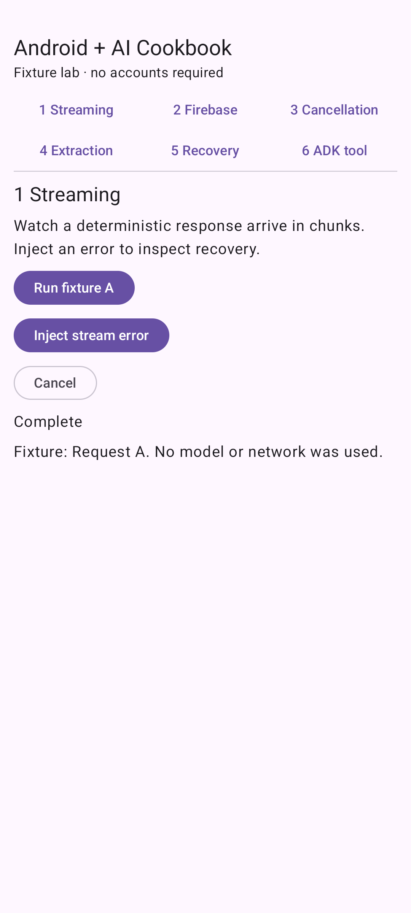

# Gemini Chat for Android

Build chat, streaming responses, structured output, and tool calling.

**Status:** Examples available · simulated responses.

## Try the available examples

- [Fake model, real Compose streaming UI](fixture-streaming-ui/README.md)
- [Cancel a response when the user changes tasks](lifecycle-cancel-stream/README.md)
- [Validate structured extraction](validated-extraction/README.md)

[Open Recipe Lab](../../samples/recipe-lab/README.md) to run these examples. It is the shared Android Studio project; this folder contains the feature guides.

Live Firebase inference and real-model ADK reasoning remain unverified. See [verification details](../../docs/verification/v0.1.0-fixtures.md).

## Learn step by step

[Follow the Gemini Chat for Android learning path](https://www.androidengineers.in/roadmap/gemini-api-android?utm_source=github&utm_medium=repository&utm_campaign=android_ai_cookbook&utm_content=topic_index).

[Browse all features](../README.md) · [Cookbook home](../../README.md)
